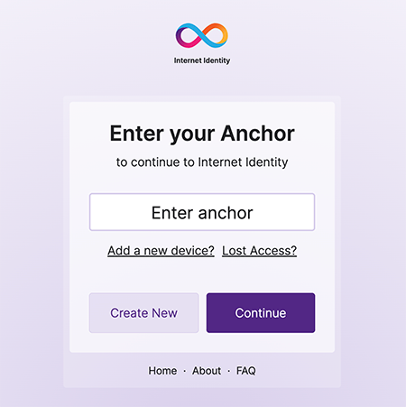

Back at the Genesis launch event for the Internet Computer, we announced Internet Identity, a passwordless authentication tool for linking different devices together. It has a goal of being like the Google oauth flow, except it yields a delegated cryptographic identity, used to sign messages.

In the world of authentication, there are no perfect solutions. We're working to balance user behavior, which will always lean toward insecurity, user preference, which leans toward systems that already have mass adoption, and security. Since browsers are a mess of security hazards, it is risky to ever "permanently" log someone in, even if the user would prefer for their device to simply work forever once authenticated.

## The strengths

The Internet Identity strategy has some significant strengths that I think are worth explaining.

### Signatures over tokens

Now that the browser has access to the `SubtleCrypto` interface, there is very little reason not to be using signatures these days.

### Delegated Identities

### Passwordless with WebAuthn

## The Weaknesses

### Signup is cumbersome

### Limited recovery strategies

## What should come next

One of the key issues with Internet Identity is that it is narrowly scoped around producing identities that are able to
