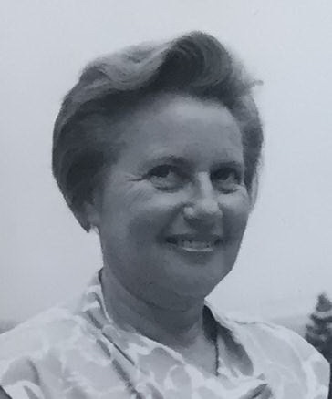

> Update - I received citizenship on May 29, 2024! See [https://kaipeacock.com/blog/naturalization/update/](https://kaipeacock.com/blog/naturalization/update/) for more info!
> The original article from September 26. 2022 explaining my family history is preserved below

I am in the process of getting my family documentation together to pursue German citizenship. It's an interesting journey, and I thought I would document some of my experiences here both to tell an interesting story and to hopefully help other people walk through the process themselves.

When I first started considering applying for citizenship, early interpretations of the law implied that fluency in German was required for anyone to apply. I started taking German classes, but the law has been clarified so that there are no additional requirements beyond being a qualified descendant of someone who lost their citizenship under the Nazi regime. After confirming that with the embassy, I was ready to begin.

## The Law in Question

According to [german.info](https://www.germany.info/us-en/service/03-Citizenship/-/2479490):

> Under Section 15 of the Nationality Act, individuals who surrendered, lost or were denied German citizenship between January 30th 1933 and May 8th 1945 due to persecution on political, racial or religious grounds are entitled to naturalization.
>
> This ruling applies to:
>
> - Individuals who surrendered or lost their German citizenship prior to February 26th 1955, for example through acquisition of foreign citizenship on application, release on application or marriage with a foreigner, or
> - Individuals who were excluded from the legal acquisition of German citizenship through marriage, legitimization or collective naturalization of Germans due to their ethnic origin, or
> - Persons who were not naturalized following application or who were generally excluded from naturalization that would otherwise have been possible upon application, or
> - Persons who surrendered or lost their habitual abode in Germany if this was established prior to January 30th 1933 (in the case of children, also after this date).
> - Descendants of the above-mentioned individuals

This law initially covered people directly affected, but in the last couple of years, the interpretation of the law has now extended to descendants like me.

## My Family's Story

I'll go into some more depth later on about my family's full stories, but I want to cover briefly here some details about how my family came to the USA.

My great grandparents were German Jews who fled to the US during the Holocaust. Walter Lowe and Henny Mann fled independently to Chicago in 1937 and 1938 respectively, where they met. By going through naturalization in the US, they lost their

The Lowe family name traces back through multiple name changes, from Löwinskÿ to Heÿmann Lewinski, the first we are aware of in that family line. Heÿmann was born in Berlin in 1844, and the family remained there through 5 generations. Walter was born in 1915, and lived in Germany until 1937, when he was forced to leave Germany.

Henny (born Enrichetta Mann) was born in Rome, Italy, and her family moved to Wiesbaden, Germany later that her so that her father, Martin Mann, could serve in the war for Germany. They moved later to Darmstadt, where they lived until they fled Germany in 1939. Henny moved here with her brother Ferdinand, and moved to Chicago. Henny and Ferdinand were joined by their parents a few years later, in 1941.

Walter and Henny moved to California had two children, my Grandfather and his brother. Two generations later, my siblings and I am one quarter German-Jewish, and we are preparing our documentation to apply to have our German citizenship restored.

## What We've Done So Far

Some of my cousins, who are descendants of Henny's brother Ferdinand, have already opened the door for us. They applied for and received their German citizenship in 2021. We will be able to cite their successful applications in our own process, tracing our family back through my great great Grandfather Martin Mann.

We've been gathering all of our documentation, and now I'm in the last few steps before submitting my request to the German embassy in San Francisco. This week, I sent off a request for a Letter of Good Conduct from the US federal government, and I also got a notarized scan of my passport to attach in my packet.

## Next Steps

Once the Letter of Good Conduct comes in, I will print and assemble the various forms and addenda, as well as scans of all the birth and marriage certificates going back to my family. I'll request an audience with the German Embassy, and hope for the best!

## August 2022 Update

I have an appointment date! On August 29th, I'll be presenting my papers. I have the letter of good conduct, and I've printed out my first copy of the forms and all my organized family documents. Now it's time for some final reviews, and I'll have everything I need to take to the embassy!

## September Update

The August 29th appointment fell through, since I tried to book with the Los Angeles embassy. They cancelled the appointment and asked me to book with San Francisco. After a few weeks, a SF appointment opened up, and I was able to present my documents to the German Embassy in San Francisco on September 22. The embassy told me that I should have submitted a form 116, whereas I used form E-15. Fortunately, the E-15 functions the same as 116, with only additional information, so I didn't end up needing to re-do anything. Unfortunately, I am not done yet. There are some documents I'll need to fetch before the embassy will submit my application.

Fortunately, since I now have an active application, I'll be able to mail the remaining documents directly to the embassy (with a self-addressed return envelope) instead of making more appointments. Also, the embassy told me that since my cousins have already gone through the process, from Henny's brother's side of the family, we have a much stronger case going through her side of the family. Additionally, any family members who qualify for the same reasons as me are encouraged to join my application, with just a few documents of their own.

Here are some things the embassy has asked me to provide in order to complete my application:

### 1. Original Documents

For many of the birth and marriage certificates I provided, I only had scans of documents. The embassy only will accept official copies, so I need to either get my family members to mail their certificates in to the embassy, or I need to request new originals from the various vital records offices where they all took place. This includes:

- my parents
- my grandparents
- my great grandparents

### 2. Missing Documents

My family doesn't possess a marriage certificate for my great grandparents, and we also don't have a birth certificate for my great Grandmother, Henny, who was born in Rome. I will need to submit genealogical requests for these documents in Chicago and Rome, respectively.

So far I have mailed a request for my great grandparents' marriage certificate from Chicago.

I've reached out to the records department in Rome with an auto-translated inquiry about the fees to pull Henny's birth certificate. If I don't hear back from them, I may work with https://www.italycertificates.com/ to see if they are able to help me complete the process, since this will be the most complicated step.

Next I'll have to wrangle all of the other documents from my family members.

### 3. Documents Submitted

As of November 7th (the day before the 2022 midterms), I have all my documents in the main to the embassy! It took a few weeks to request new original documents, since not all of my family members wanted to part ways with their birth certificates for an indefinite length of time.

Fortunately, my grandparents were able to find my great grandmother Henny's birth certificate in storage. I still haven't heard anything back from my documentation request to Rome, so who knows how long that process would have stalled everything.

Also, in addition to getting the missing documents together for myself, I spent two weekends visiting my family and forcing my mother and brothers to sit down and fill out their applications. I've sent in their paperwork with my last documents, so the three of them are going to join my application and pursue citizenship at the same time!

Now we wait for the embassy to process the documents and let us know if we're ready to proceed, sending the applications to Germany for official processing.

4. Pending

As of November 9, 2022, our applications were approved and sent to Germany. There were two notes the embassy had that might potentially be flagged, since Chicago wouldn't give us "original" documents of my Grandfather's birth certificate or my great-grandparents' marriage certificate. However, we are now waiting to hear back from the Bundesverwaltungsamt (BVA) about our application. This could take anywhere from two months to two years.
