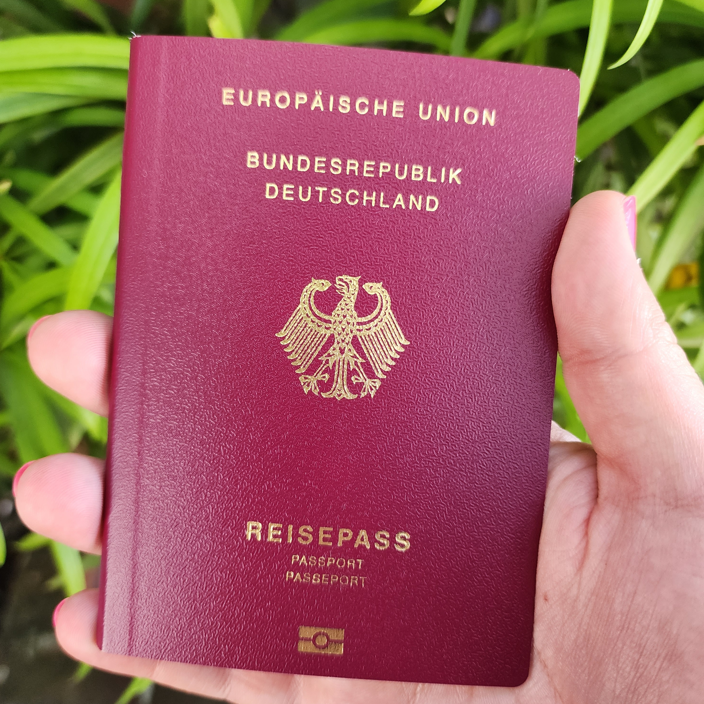
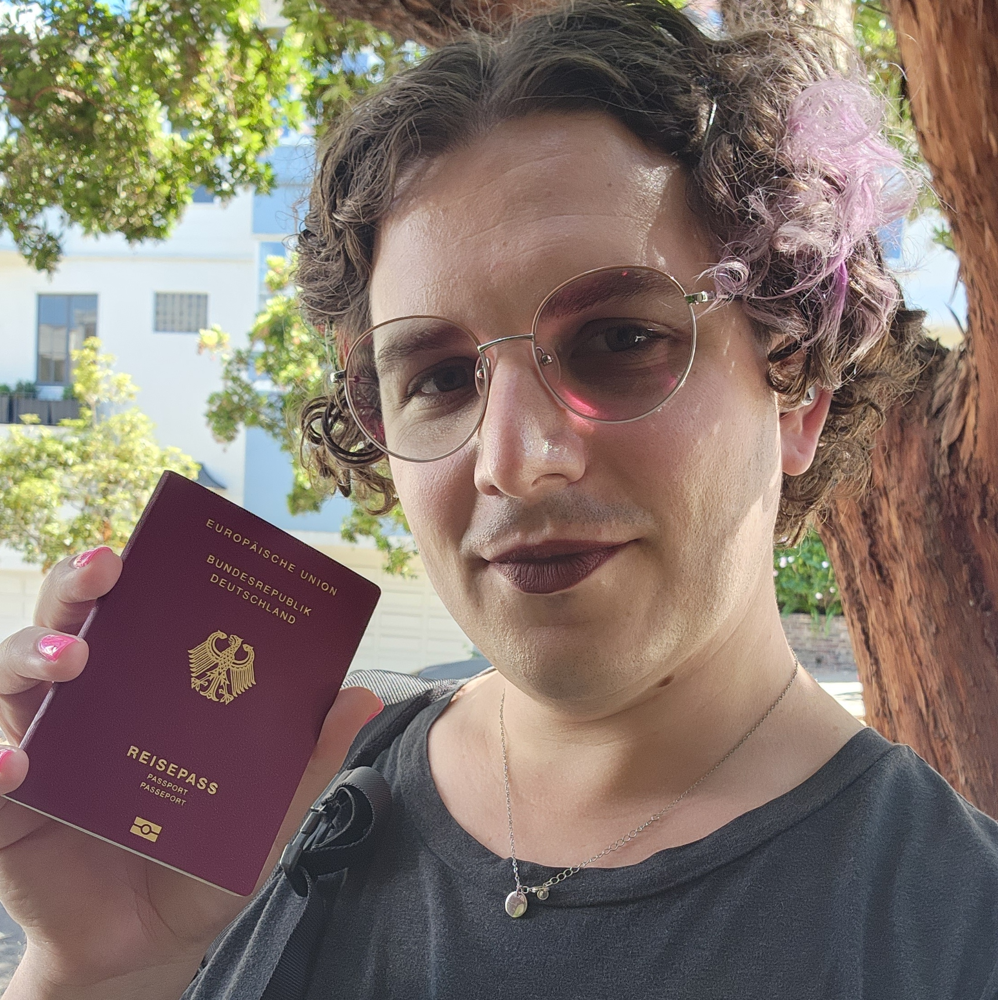

On July 30th, 2024, I received my German passport.

There were some interesting new updates in this last leg of the journey, and I wanted to document that experience here.

## The Passport Appointment

I had my passport appointment on July 3. That day, I forgot to prepare passport photos, but I have the rest of my application together, and arrived on time at my appointment. I was only able to get this appointment by emailing the office, since they can make a scheduling exception if you have plans to visit Europe. Because I had a trip planned already in September, they were able to fit me in.

Most of this was normal procedure, but I noticed on my phone that I had an option to select a non-binary gender marker. I already have one on my US passport as well as drivers license, and having the opportunity to have my gender reflected on my German passport seemed exciting. It turns out that there's some history behind this.

### Third Gender History

In 2018, Germany codified § 45b PStG, (Personenstandsgesetz), and established a "diverse" third gender category. The category was explicitly intended for intersex people, allowing doctors to designate infants as neither male nor female. The original law required the involvement of a doctor, and included the possibility of updating ones gender marker with a doctors note. However, non-binary Germans were interested in accessing the category, but were denied by the Federal court of justice in 2020.

This held until recently, when Germany passed the self-determination act in April, which opened up the process for people to freely identify as third gender. This is all very exciting, but it becomes even more interesting given the unique circumstances. The self-determination act goes into affect in November of 2024, so most people haven't had access to it yet.

### My Experience

I emailed ahead to the embassy, and asked if I would be able to identify as diverse in my application. Because I am not changing my gender. As far as Germany is concerned, I didn't need to access a gender change form or a process that is still being developed. As a newly minted German, my passport is my first document to reflect my legal gender identity, and was not subject to the same process. My contact at the embassy, Andrea Thüroff, who helped me through my citizenship process, let me know that I ought to be able to receive an X marker thanks to the new guidance of the self-determination act.

In the email, I was told

> "If your US documents (US passport, US birth certificate) mark your gender as “X” your German passport will be issued with the same gender marker. Instead of “F” or “M” (in German “W” or “M”) the letter “X” for “Diverse” will be entered."

On the actual day of my appointment, I brought my paperwork in with the "diverse" gender box checked, and the worker at the desk noticed it fairly early in the process. She told me "I'll have to go check about this."

I told her that I'd already written ahead about it, and that I had my US legal documents with me with their X gender markers. Amusingly, the embassy worker dismissed my comments, telling me "We don't respect US laws". Same, bestie.

### The Good News

After she went away to confer with her colleagues, she came back with an entirely different demeanor. She explained that she was going to be able to proceed, for the reasons I outlined above. Moreover, she told me that she was very excited, because as the passport officer at the US embassy, she has repeatedly had to deny applicants X gender markers over the years due to the law, and I was the first non-binary person she has ever been able to grant a diverse passport to. "I will remember you forever", she told me.

> "I will remember you forever", she told me.

The rest of the application went smoothly. I had to run out and get some photos taken at a nearby photo shop, but once I returned with them and paid for an expedited passport, I was done and just had to wait a while.

As I sat with the knowledge that I was the first to receive a passport with an X marker at the SF embassy, I began to wonder. These are fairly niche qualifications to be in. How many other people in the world:

1. Have recently received German Citizenship
2. Are applying for their first passport between April and November 2024
3. Identify as non-binary and would seek an X gender marker on their passport

I know I was the first to have the stars align at the San Francisco embassy, and non-binary identity is much more common in the Bay Area than other locations around the world. This was a very special privilege for me, but it's possible that I am the first German adult to be granted an X gender marker under the self-determination act.

If anyone has other information about this I would be delighted to learn more about the community of non-binary German citizens that I'm now a member of. In the meantime, I'll hold dear the honor of perhaps being the first of many to have legal recognition of their gender identity and diverse experiences in German law.

## Getting the passport

This part is a little less monumental, but does document the final steps of this journey.

The embassy attempted to deliver my passport via FedEx, who predictably "failed to deliver" my passport to me a week or so ago by not ringing the doorbel. They eventually brought it back to the embassy and I was able to drop by and pick it up in person.

Sure enough, my application was accepted and my passport arrived with the X gender marker!

This journey seemed almost unreal two years ago, when I started considering whether it would be possible for me and my family to attain German citizenship. Now, I couldn't be more excited to make my first ever pilgrimage to Germany this September, setting foot in my family's homeland for the first time.

My fears around rising facism in the United States, particularly targeting transgender people, played a role in getting me started on this journey. There's a poetry that I will be ending this story by visiting places that my family lost access to generations ago. I will be able to return as a full citizen, with my gender legally reflected in my passport.

There are fights and challenges ahead. Neither Germany nor the US adequately protects trans people. Both boast of rejecting antisemitism while silencing Jewish anti-war voices and backing the Israeli ethnic cleansing of Palestine. I have always had a great deal of privilege I can rely on as a white, educated, and strong person in the United States. My fears are mild in the face of many other forms of violence and privation in the world today, and I will not settle for incomplete justice that extends to me and my people but not to all.

However, it's important to recognize when good things happen. I'm grateful for everyone who fought to make this set of circumstances available to me. We live in a world with great and historic injustices happening all the time. Restoring the citizenship of a great-grandchild of refugees from genocide is an uncomplicated and good act. Today I'm proud of the justice I've worked for and now achieved for my family.
