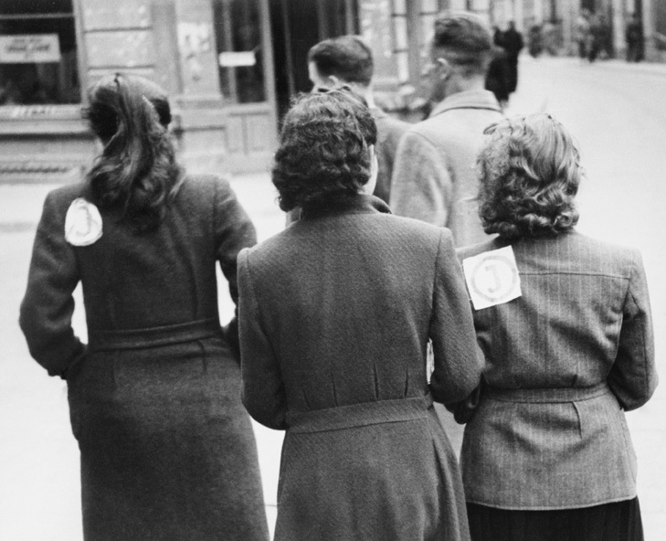

> <h2>
>   The Gestapo man pointed his revolver at me. ‘Come down, little bird, or I’ll
>   shoot’
> </h2>

Note - this is an article authored by Paula Litteauer, my great aunt once removed. It contains excerpts from her diary as a refugee in hiding during WWII, published in the New York Times. You can read the full text here, or download the PDF down at the bottom of the page.

[Jump to PDF](#full-pdf-and-download)

---

_Paula Littauer, a German Jew, fled her homeland in 1942 and went into hiding in Nazi-occupied Belgium. Her diary, previously unseen, is a chronicle of extraordinary courage and endurance_

**Jewish Survivors Report. Documents of Nazi Guilt No 5
My Experiences during the Persecution of the Jews inBerlin and Brussels, 1939-1944. By Paula Littauer**

In this diary I have tried to write down everything I experienced
in order to tell my child what I have gone through and suffered
during this terrible war, in case I should not survive. My first diary
which I began to write in Berlin I had to leave there when I was
forced to flee.
I want to tell only what appears to me of special interest and what
I kept in my memory. First the story of two and a half years in
Berlin and thereafter my experiences in Brussels.

## 1.

It was the day of the declaration of war. For me the
outbreak of was meant the shattering of all my hopes
and plans. I had prepared my emigration to England and
everything was almost ready so that I could hope to be
very soon together with my child. Now that hope has gone.
After the outbreak of war Jews were no longer permitted to be
out in the streets after 8pm or to stay in other people’s houses after
that hour. Two weeks later all wireless sets were taken away from
Jews. We had become prisoners – nay, worse, outlaws exposed to
all kinds of insults and humiliations.

All of a sudden Jews were ordered to evacuate their homes, in
some cases fairly spacious flats, within five days. That meant we had
now been deprived of our right to have a dwelling of our own. No
appeal was permitted. On the 1st of July, 1940, I received the order to
move from my flat within five days. At the same time I received an
order forbidding me either to sell or give away any of my furniture,
or to store it with other people. I really did not know what to do. As
a Jewess I had no claim to another dwelling. The only way out was
to rent a room and try to furnish it as best I could.

I was lucky. Mrs Schwarz who lived in the same house offered
me an empty room in her flat. In the meantime many people came to inspect my flat. The landlord was no longer entitled to dispose of it. Only the Nazi Party had the right to do so, as it
was Jewish flat. The prospective tenants were all “home-comers”
(Heimkerhrer), i.e., people who had returned “home to the Reich”.
First a couple from Brazil, whose children had played an important
part in the Nazi Party over there. Now all of them had returned.
But they did not get the flat. It was given to a young couple from
Riga, “home-comes of the first degree”, as they told me. The
woman expected a child and that was decisive. When inspecting
the flat she told me among other things: “After this was Germany
will be so rich – she will use golden chains for the cattle”. It was
such and similar nonsense that one had to listen to. Everyone
regarded it as a matter of course that National Socialism would
conquer the world.

Although I had spent in my flat the saddest and most sorrowful
time of my life – there I had been separated from my husband,
my child, from all the things I had lifelong loved and cherished –
nevertheless when I parted it was with a heavy heart. I was alone
and I felt that it might conceivably mean the loss for ever of a
home of my own. And what is a woman without a home?

There was a lot of work to be done and I had to do it practically
all alone, no wonder I overlooked a good many things. On the
evening of the moving day when I sat alone in my new room, dead
tired and exhausted in body and spirit, I suddenly remembered
that I had left in the old flat all my “black” money (Jews were not
allowed to have more than 300 Marks in the house). The money
lay hidden under a wardrobe and I had forgotten to take it away.
I ran upstairs but the money was gone. The workmen, of course,
had found it when removing the wardrobe. There had been several
thousand Marks, so I was in a bit of a bad plight. After a sleepless
night I decided to approach the men all on my own and try and
settle the matter in peace. By accident I learned the names of the
two workmen and went to see them. After negotiations lasting
several days I did manage to recover the money, every single
penny of it. I appealed to their pity for a woman and a Jewess, and
it worked. The men got a handsome reward. They didn’t mind
telling me, by the way, that I would not have got a penny back if
I had come with the police, but because they hated the Nazis and
because I was a Jewess they would give it back to me. Of course, I
could not have done anything as it was “black money”.

The persecution of the Jews grew worse and worse. Theatres,
cinemas, concerts, etc, had, of course, been long forbidden to us.
Every café and restaurant displayed a poster “Jews not admitted”.
Since we had to be home by 8pm, it was through reading books
and more books that we managed to keep ourselves alive
spiritually.

After Belgium and Holland had been occupied by the Germans
I hardly received any news at all from my child in England. It was
a great blow to do without those beloved letters.
Time went by. I tried several jobs, but whatever I started I had
to give up soon because “Aryans” were not allowed to train or
employ Jews.

Compulsory labour for Jewish women was introduced. At first
only the young were called up, so my age group was still exempted.
But after a time, it no longer seemed to matter although I knew
that Jews were forced to work under exceptionally bad conditions.
The Yellow Badge which we had to wear as from September
19th, 1941, signified the prelude to all the horrors that followed.
Being clearly marked, we were exposed to every kind of malice and
jeering insult. A large proportion of the German people certainly
did not approve of this persecution; but Hitler’s ardent followers
did whole-heartedly. The glaring yellow would shine from afar,
so that it was possible to recognise a Jew from a considerable
distance. Many poor Jews were brutally ill-treated and insulted.
I myself experience only once something of that kind. I was
boarding a tram in front of a few “Aryans” – this was a punishable
offence for Jews. As it was very cold and I was shivering I had done
so quite without thinking. Suddenly I heard an “Aryan” shouting:
“You swine, you filthy sow, you’ve got to wait till all Aryans have
got in You ought to be packed off in cattle trucks”. I was standing
on the platform because Jews were not allowed to sit down. I kept
quiet but tears were rushing down my cheeks. In the whole tram,
an icy silence. Not one single soul there dared to say a word.
By and by it was hardly necessary to see the badge is order to
recognise a Jew. The years of persecution had transformed uptight,
intelligent and self-respecting people into figures from the Ghetto.
From far away one could recognise a Jew by his bent deportment,
his careworn face and the shy terrified look, in addition to the by
now very shabby clothing and the signs of malnutrition. I still see
them sitting crowded together in the department of the Jewish
Communal Office dealing with emigration to the USA, careworn
and in despair, hopelessness on their faces.

One day early in October, 1941, I had to go to the dentist. On
my way to him I wanted to visit Elsa D. After coming up the stairs
I suddenly stood in front of a sealed house door. Jews were not
allowed to have a telephone and as I therefore had not talked
to her for quite a time, I did not understand the meaning of it
all. I went to the porter to hear what had happened and he told
me indignantly that the Gestapo had suddenly in the middle of
the night entered the house and taken all Jews not only from
the house, but from all houses in the neighbourhood. They were
packed into lorries and all they were allowed to take along was a
small suitcase. The flats had been closed and sealed and that was
that. A few days later the Nazis carried away all the furniture and
household goods.

In deep distress I arrived at the dentist. He knew all about it.
The raid had started quite suddenly and the Jews had been taken
from various districts of the town. That was the beginning. We in
Berlin had heard that Jews had been deported from Stettin and
other towns but had thought these were local actions for some
special reason.

Three weeks later I received my “notice”. It is done in the
following way: the Gestapo makes use of the Jewish Communal
organisation. At first you are given notice. With this paper you
have to go to the Jewish Communal Office. There you are handed
lists where you have to enter everything you possess: property,
outstanding debts, real estate, furniture, household goods, clothes,
linen, shoes, etc. In short, everything. As my notice was addressed
to my husband and he had emigrated a long time ago I was able
to defer my misfortune for a short while. I stated that my husband
was no longer the tenant of the flat, that it had been let to an
“Aryan” some time ago. Once the lists had been filled in and
handed over you had to wait for your number together with the
date of your deportation.

When these deportations began every kind of emigration was
stopped. The cable of my family from America expressing the hope
to get us to Cuba had by now become meaningless.
In desperation and helplessness we all faced this new
misfortune which had come over us.

Our jewels, our gold and silver had been confiscated a long time
ago. Our furs had been taken away only recently. It was a very
very cold winter. And now on January 16th we had to hand in our
woollen things. Every Jew was allowed to keep one coat, one dress,
one pullover, one pair of stockings, one pair of trousers and one
pair of gloves. That was the outfit which the deported Jews were
allowed to take to Poland in the bitter cold. No Jew was permitted
to wear anything trimmed with fur. Before they were deported, all
fur trimmings were removed from their overcoats.

Suicides were the order of the day. Whole families died out this
way.

After the deportations had started in October, when thousands
of Jews were carried away from Berlin week after week, I had been
urgently advised to leave the “Aryan” and to move into a Jewish
house. But that was not so easily done. No Jew was allowed to
change his residence without permission, which was very difficult
to obtain, as it was only given in urgent cases. But with the help of
various connections I succeeded in getting this permission. Frau
Weissenberg who owned a little house in Tempelhof – it was more
of a cottage than a house – offered me lodgings, to share a very
small room with another lady who was a total stranger to me. But
what did it matter, as long as I got into a Jewish house where I felt
safer.

On October the 30th I moved in. Some of my furniture, carpets,
pictures etc. I hid in a cellar. After having lived there hardly more
than two weeks, Mr and Mrs Weissenbeg were suddenly taken
away in the night of November the 17th and deported to Poland.
It was terrible. The Gestapo arrived as usual in the middle of the
night. We all had to get up and show our papers. I can still see
those sinister brutal fellows. Never had I thought it possible that
there were so many of them in Germany.

Soon after this I received my calling-up papers for compulsory
labour. On December 20th, 1941, I was sent by the Labour
Exchange to the firm of F. Schuckhardt, Ltd., Koepenikerstr 55, as
a worker. For Jews the work began at 6 o’ clock in the morning. At
5.50am we had to be in the workshop. That meant I had to get up
at 4am, prepare breakfast, tidy the room etc. At 5am I was already
in the street, which was icy cold and pitch dark. I cannot imagine
how I had the strength for this. At first I worked as an engine
fitter, later at the drilling machine. Ten hours a day at a piece rate.
Those whose output fell below the set standard were threatened
with the Labour Exchange and deportation to Poland. One hardly
dared look up from one’s work. Although the foreman and master
workman were kind and the treatment within our first decent on
the whole, the work naturally was far beyond my strength. At first
I worked in the Jewish department of the firm in Admiralstrasse
in the former Admiralspalast, which consisted of one icy-cold
room, three stories high, containing one iron stove in a corner
but no windows or daylight. Our job was to unload thousands of
old machines and to mount them. My bronchia did not stand up
to the cold and the dust, and very soon I was laid up with a bad
bronchitis. There was nobody to look after me, I had little food
and a very cold room; but we had become so accustomed to all
this misery that we did not feel it. Two weeks later, when the fever
had hardly gone, I had to begin work again. In the Admiralstrasse
there were only Jews and almost exclusively middle-aged people,
from many kinds of vocations and professions. Former bank
directors, architects or judges worked as hard in their menial jobs
as former society ladies. We all worked as hard as we could. For at
that time we still believed that by working, we were protected from
deportation.

When I came home at about 5pm, I had to do my shopping
hastily, as Jews were supplied only between 4 and 5pm. At this
time the rush was on, so we had to queue up and wait. Back at
home I cooked my supper, i.e. the little that we Jews were allowed.
At 9pm I was in bed. I never slept for more than five hours. We
Jews did not get any milk, white bread or cake, no fish or poultry,
no eggs, cereals, tinned food or sweets, and none of the better
vegetables or fruit. Thus we had to live on a monotonous diet of
cabbage, swedes, potatoes and cabbage again. We were happy if
secretly a kind woman gave us a few carrots. During the day I lived
on substitute coffee and a few slices of bread with margarine. The
little butter we were allowed was just sufficient for a few days.
It was clear that not even the best constitution could for long
stand up to all this strain. Still I was ready to bear all that in order
to avoid deportation to Poland.

Four weeks later, all the lodgers had to evacuate the house
in Tempelhof, after all the trouble I had in moving in six weeks
earlier. The possibilities of removal were very limited as nobody
dared to work for a Jew. Moreover, I had no time to look for
another room. By a lucky chance a room was offered to me at the
flat of a Mrs Borchardt, Kurfustendamm, 45. I was glad to have a
roof over my head although owing to a lack of time I had to leave
the whole removal to strangers. I had managed to get a room for
myself alone. Then there was central heating in the house, a real
boon considering the extraordinary temperature of this winter. On
the other hand I had to get up even earlier as no workers lived in
this neighbourhood and the transport connections were very bad.
At 4.45am I had to leave the house. It is impossible to describe the
loneliness and horror of these hours when I wandered about in icy
weather and pitch-darkness. Without the firm will to stick it out
I hardly believe I could have stood it. Hunger, cold and ten hours
hard work – all this was quite tolerable compared with the menace
of deportation.

From the Admiralstrasse I was transferred to the main
workshop in Koepenikerstrasse, where I was trained as a turner.
There were always two women at one lathe. Here too, as the
Jews were working in a dark stuffy room just over some stables.
There were only Jews in our part of the building, and therefore,
it seemed ridiculous for huge signs with the Shield of David to be painted even on the lavatory doors. It was almost impossible
to complete the amount of work demanded. We had only old
machines and for that reason there were frequent breakdowns.
The fine metal splinters penetrated my skin so that my whole face
was disfigured. During the intervals, or when the bell rang at the
end of the day I dared to look up. Otherwise I did not risk resting
even for a minute. In spite of the cold, the sweat was pouring over
my body, and I was working feverishly in order for fulfil my task
satisfactorily. At 4pm, the work finished, we packed our cases and
left as quickly as possible.

As Jews were forbidden to sit down in the tram I had to stand
three quarters of an hour, completely exhausted as I was, and after
that I had to stand again in the queues for about the same time.
Soon a new decree was issued to the effect that all Jews living
seven kilometres or less from their place of work had to walk.
Many of us, therefore, had to walk for over an hour. By and by
they began to deport Jewish workers from our firm. We were all
gripped by fear and panic. We worked like slaves in order to please
our masters. My foreman promised me again and again to do what
he could to keep me. But as we were an armaments factory of
only secondary importance, not all applications of the firm were
granted. I lived in perpetual fear.

When I came home and saw letters on my desk, my heart
started beating with trepidation. For any day the death sentence
might arrive. It was the exceptionally cold winter of 1941-42. The
poor deportees were first collected in a former synagogue in
Levtzowstr, where they stayed sometimes for two or three days. As
soon as 1500 to 2000 were got together the transport went off. The
poor people had to walk the whole way from the Levetzowstrasse
to the Grunewald station, from where the trains always departed.
That meant a march with luggage of nearly two hours in freezing
cold weather – and then they were loaded half frozen and
completely exhausted into unheated cattle trucks. Many died on
the way.

The population saw the columns of these miserable people
marching through the streets of Berlin and nobody risked even
a word of protest. At first the Jews were transported only during
the night, but later the Nazis felt so secure that they risked it even
during daytime. The fear of the Germans in face of the Gestapo
was indescribable.

Every one of us prepared for this ordeal as well as was possible.
We had no furs left and only very few woollen things. Moreover
the trucks for the luggage were uncoupled finally before the train
left, as I was told by my cousin S. who, on behalf of the Jewish
Community, was in charge of these transports. Therefore it was
useless to take much with you as the Gestapo would steal it
anyway.

Four weeks later when I came home from work I saw the
dreaded envelope on my desk. Now my fate seemed sealed. I knew
that deportation in that icy temperature would mean my certain
death.

At first I went to the foreman and again asked him urgently to
make an application on my behalf. He promised to do everything
possible. Then I went to my doctor. An operation which had
been contemplated a long time ago but which was not absolutely
necessary might defer my deportation for two months and by then
the worst of the cold weather would have been over. It was now
the end of January. But new regulations prevented the admission
of Jews into any hospital without a previous medical examination
by a health commission. My own doctor could no longer decide.
I had to appear before the commission. In addition, the factory
doctor had to agree too. I cannot enumerate the incredible number
of errands I had to run after working for ten hours without food,
tired and dejected. In spite of good connections I was sent from
one place to another to obtain permission to undergo an operation,
should the application of my firm be rejected. I was so desperate
that even a grave operation seemed like salvation. Many people
have undergone the most complicated operations which were
not really essentially only to be allowed to stay a little longer in
Germany.

My doctor gave me a certificate stating that my life was in
danger, of which the doctor from the commission had been
informed and the works doctor, to whom I showed the certificate, did not even bother to examine me and signed his agreement. Now I
had to face days of torment waiting to hear whether the application
of my firm would go through. As Jews were now deported in
masses, particularly single women, my chances of remaining were
very small. Also it was almost impossible to get a bed in the Jewish
hospital, the only hospital permitted to take in Jews.
My net income from my work of 52 hours a week was 18.30Mk
per week after deduction of taxes etc. This was not enough even
to pay for my room apart from food, etc. All the money that I
possessed illegally I had sewn into a pocket of my dress in order to
have something which would not be confiscated by those robbers
should I be deported to Poland. An operation would have cost a
lot of money. My doctor was not allowed to operate on me and the
health insurance did not pay for operations or hospital treatment
of Jews, although we Jews had to pay our contributions exactly as
the non-Jewish workers.

In the meantime I had to complete my forms for the Gestapo.
On the fixed date, I had to take these forms to the Jewish
Community Building where the Gestapo had a special room. Here
the master over life and death was sitting. He threw a printed
paper at me and called out “sign it”. I signed. “Stand by the wall”,
he shouted. I went to the wall and then the Gestapo boss read
to me the paper which I had signed but had not been allowed to
read, stating that my property had fallen to the State, that I had no
claims, that I had admitted my guilt, having committed subversive
acts, that I had been expatriated, etc. I would have loved to jump
at the throat of that brute. More dead than alive, I left the room.
Some time elapsed and I began to hope that the application of my
firm had been successful. I kept my operation in the background as
the last line of defence.

Now it was March and a few days before Easter. On Good
Friday and on Easter Saturday respectively a transport of 15,000
Jews each was to go to Poland. I had not been notified that I was
to go with one of these transports and still hoped to get away with
it this time. For the Tuesday after Easter a bed had been reserved
for me in the Jewish hospital. I had packed everything, both my
things for Poland and my suitcase for the hospital. My dresses,
underwear, shoes etc. were still in my room. When I came home
from the factory on Wednesday I found my cousin S. in my room.
He told me that transports were going away on Thursday and
Friday and I should on no account sleep in my room. Although
I had received no information and did not fear anything, still I
followed his advice and did not sleep at home. When I hung up
“Aryan” neighbours who had put the telephone at my disposal, on
Thursday morning (I did not go to work as I had been reported ill),
and asked whether anything had happened I was shocked to hear
that the Gestapo had come at 5 o’ clock in the morning to take the
“Yid” as they said. As the lady where I lived did not know where
I was, she told the Gestapo that I went to work every morning at
half past four. The Gestapo rang up the factory but I was not there
either. They told them I was ill. Ringing up the Jewish Hospital
the answer too was in the negative. As they could not find me they
came back at ten o’ clock in the morning, closed and sealed my
room and ordered the house-porter to detain me when I arrived
and deliver me to the Police.

It was March 2th, 1942. I shall never forget that day. Now I
could not go back. The hospital could no longer admit me. And
in addition I had committed a punishable offence by staying away
during the night from my lodging without permission. I was in
despair. There was no way out but to surrender to the Gestapo.
Now I had lost everything I had. All my money, my clothing,
underwear, shoes, furniture, suitcase – all that was in the room
now sealed by the Gestapo. A little suitcase with a few necessities
of life I stored some time ago with some non-Jewish friends. But
that was not enough as all coats and woollen things were missing.
I stayed now with my sister who until then had not been
troubled. The Gestapo was looking for me in my former lodgings.
Wherever they went the porters had to show them through the
whole house. I dare not go out into the street without fear of being
recognised and arrested. I could not stay with my sister, either, as
there was danger of my being sought for there. Thus I slept every
night somewhere else, harried and hunted like an arch-criminal.
The last few days I stayed with Felix S. who was very kind to me. One evening Mrs R. came and asked me whether I had the
courage to go across the frontier. As I had nothing to lose I agreed
immediately. She told me she knew the address of a Belgian who
smuggled Jews out of the country with the leave papers of French
workers. It was very dangerous, a matter of life and death, but I
might be lucky.

On Saturday my sister Anne went to the address of the Belgian
as I did not dare leave the house. There she found a couple, the
woman very young and very nice, the man drunk. They were
Belgian workers and told her that the next workers’ leave train
would be going twelve days later and that they were willing to
take me. Next evening they wanted to come to the house of my
sister to discuss the matter. On Tuesday evening, April 7th, two
very dubious-looking men arrived with their wives. I had asked
my friends Walter and Lotte to be present. The smugglers asked
3000Mks per person, and for this sum they would obtain the
papers of a French working woman. My sister suddenly decided
to go with me. At first I tried to dissuade her, as she had not been
bothered hitherto. Sooner or later, however, they would look for
her too, and so I acquiesced. The Belgians told us they would take
up to four persons, and that besides us a Jewish couple would go.
There was nothing left but to pay the price demanded. My black
money was in the sealed room, but I still had a few carpets and
pictures hidden away in the cellar. These I sold secretly in the
middle of the night, far below their value, but I obtained enough
for the smugglers. I did not know these people at all, and yet I had
to hand over the money in advance as they – so they told me – had
to buy the papers. It was a very risky transaction but there was
no other way. French workers who did not take the home leave to
which they were entitled sold their papers and stayed secretly in
Berlin. I gave the money to the man and he told me he would get
the papers the next day.

Meanwhile Anna packed her things. Each of us could take one
to two small cases. Friends and even helpful strangers gave me
what they could spare, for I had hardly anything left. One gave me
a blouse, another an apron, shirts, stockings, etc. In short, everyone
helped as much as they could, for Jews were not allowed to buy
anything as they were not given coupons for clothing or shoes.
Wednesday passed. On Thursday at 3 o’ clock we were told to
be at the Potsdamer Station from where the train left. We could
not do anything but go to the station with all our things. If we had
fallen into the hands of swindlers we would have lost even our
last possessions. But after the experiences of the last few years my
feelings were blunted. When I crossed the streets for the first time
without wearing the Jewish star I had the feeling that everyone
must see what I was up to, although I don’t look particularly
Jewish. Dressed like a worker with a kerchief and old coat, I
arrived safely at the Potsdamer Station. Anna went alone. When
I arrived there I saw at once our leader. Quickly and secretly he
gave me the papers and the ticket. In order not to be conspicuous
I was not allowed even to look at the papers. Thus I did not know
my new name, nor where I was born. I sat down on my suitcase
and realised that my life’s achievements had resulted in a suitcase
with a few necessities, which was all I had saved.

The train with five hundred workers, men and women, went
to Paris. We could choose whether we wanted to go to Brussels or
to Paris. We could choose whether we wanted to go to Brussels or
to Paris. We decided in favour of Brussels. Hours of torment and
waiting on the station, as at 3 o’ clock we had to be there, but the
train did not leave till 7pm. In the meantime I saw my sister arrive
and then the couple, arriving separately. I saw at once that they
did not belong to the workers. One by one the workers arrived. A
very rude station official who called the Frenchmen only scum and
swine gave me my first fright.

Just before seven the gates were opened and we could pass.
There was a terrific crush. We had to keep our eyes fixed to our
leader as we were to sit together with him in the compartment. At
last the train left. The wheels moved but we were still within the
station when the doors opened: “Gestapo! Show your papers!” At
first they asked my sister. She acted as if she could not understand
German and answered only “Non”. As the Gestapo official did
not know French he could not answer. Angrily he came to me.
Without a word I gave him my papers. If he had examined me only a little more closely I should have been lost, for I had not had
time to see my new name and date and place of my birth. Our
leader interpreted and said that we did not understand German.
The first awful fright was over. We breathed again. But not for
long. In Brandenburg the Gestapo came again and examined our
papers. At this time, fortunately, French workers did not require
either passport or photo. The papers, issued by the firm for whom
they were working, were sufficient. We were all workers of the
A.E.G. Berlin Brunnenstrasse.

The Gestapo had found out that there were French prisoners
of war in the train who were trying to escape back to France.
Between Berlin and Brandenburg they had already found eighteen
men. It was a terrible situation. Numbers of Gestapo officials were
on the train and examined everything carefully. In the meantime
night had fallen. A few hours rest. But then the Gestapo came
again with torches and revolvers to examine our papers. In the
next compartment the two wives of our leaders had two prisoners
of war hidden under their seats. With God’s help we arrived at
last at the frontier. We were happy but now the real to-do began.
The wives of our smugglers were well known to the custom and
Gestapo officials at the frontier, as they travelled frequently
on this route. One of them was very beautiful and young, and
she had no difficulty in diverting the attention of the Gestapo
officials. Now we were to pass the customs and identity-paper
control. In the next compartment the two women were drinking
brandy and wine – which they had brought from Berlin – with the
Gestapo men. They flirted and forgot us. And so we could stay in
the compartment. The Jew in our compartment seemed to have
aroused their suspicion but as he talked French fluently they did
not feel quite sure of themselves.

For four hours we had to wait at the frontier. There was
shooting and great excitement. Up to now they had found 52
prisoners of war. Some of them tried to flee, two dressed in
women’s clothes. There was shooting, screaming and weeping – in
short it was terrible. Everyone was examined again. The Jew in our
compartment was ultimately taken out and placed together with
our two leaders against the wall. Facing loaded revolvers they had
to repeat their statements. Mr Levy, the Jew in our compartment,
saved himself only with his knowledge of French. Otherwise he
would have been shot. In the next compartment, the two women
were still drinking with the Gestapo, and there was much frivolity
and flirting. By this means, they managed to draw the attention of
the men to themselves. And so we crossed the frontier.

## 2.

In Brussels. More dead than alive we arrived at Brussels. I had no idea what an occupied city looked like. How wonderful would it be - so I had thought - to be out of Germany, but how different was the reality! After a journey of about twenty-four hours we arrived at the Gare du Nord at 7pm. And then we had to find lodgings for four people. Without the permission of the quartermaster’s office, no hotel was permitted to accept any guests. I did not possess much money. The little I had - a few hundred Marks - I had sewn into my best. In addition I had a little Belgian money. With the help of our French worker’s-papers we got a billeting certificate and went to a quite cheap hotel near the station. The dirty beds and the filthy room were horrible. From the moment I left the station and saw large numbers of German soldiers on the station square I had the feeling of being in Berlin and not in Brussels. To hear more German than French was a bad shock to me. Here we were, two women, alone—with hardly any money, in a strange town where we knew nobody. Homeless!

\*

We had to try and get of our dubious hotel as quickly as possible. Mr L, our travelling companion, had an acquaintance who had been living in Brussels for many years. We went to see him the very next day. We needed papers and new lodgings at once. Neither was easy to obtain. Most of the Belgians who had rooms to let no longer put notices out, in order to avoid getting German tenants. Papers were needed to obtain our ration cards. The friend of L. offered his help. A police official he knew was ready to procure identity cards for us. They were to cost 2000 francs per person, a drastic cut into my limited means, but unavoidable.

Fortunately I had my German identity card. Thus I could prove my identity and, like all other people, receive a carte d’identité with my real name but without the remark that I was Jewish. Here, too, all Jews had already a large red “J!” on their identity card. Thus we were not entered into the lists of Jews. When producing our identity cards we received our food cards and our clothing coupons, a fact which almost amused us as in Germany since the outbreak of war no Jew had been allowed to buy so much as a reel of cotton.

Now we had to find cheap lodgings. The friend of L. knew several houses of which the owners were ready to admit us, temporarily, even without police registration (in Brussels everyone had to be registered with the police within three days after arrival). Naturally the prices of these rooms were high, but we had no choice as we had to leave our hotel, which was frequently raided by police. We found a room in a house in the Rue Verte, which was not a very attractive street. It was a little street which could almost be described as the Ghetto of Brussels. The landlady was very friendly. We had to pay 50 francs per night, which was quite a lot for us, and for that sum we shared one bed. The interior of the room revealed at once the type of house. During the night things became very lively. Soldiers came and went with and without girls,--in short, we were staying in a kind of brothel.
But Madame Eve-that was the name of our landlady—was a very kind-hearted woman and both of us were quite exhausted and wanted only a little rest. In the morning we took our coffee in her warm kitchen. We had a roof over our heads and were content.

\*

On the upper floor of the house a Mr Hayeck, a writer from Vienna, also a Jewish refugee, had been living for two years. He was working for several Swiss papers and lived a very retired life. He at once offered his help and wanted to go with us to the Jewish Community Office for assistance, and find a cheap little room. I was very grateful, but on no account did I want to go to the Jewish Community (I did not want to be known as a Jewess here in Brussels). On the other hand I asked him to help us find some lodgings.

\*

The first week passed, and we hoped to find some kind of work but the outlook was poor. The following Sunday Mr Hayeck told us he had seen lodgings advertised in the Rue Linnée. I went there with him. It was one of the many old narrow little streets around the station. Being a Sunday the street was almost deserted.

\*

The landlady, Mrs Marshal, was a very kind and helpful Alsatian woman who spoke German fluently. She had a lttle flatlet to let: one room and a kitchen but without crockery. Nor did the room look very inviting: shabby dark wallpaper, one French bed, one wardrobe, wash-stand, two chairs and one table. That was all. My sister Anna was not very enthusiastic’ neither the flatlet nor the street appealed to her, but as it was very difficult to find anything we took it. The rent was 300 francs per month and, compared with the prices we had paid hitherto, very cheap. When we left our former lodgings Madame Eva presented us with an old kettle, a jug, saucer and two cups. Highly pleased, we left with these presents.

\*

On April 20th, 1942, we moved into the house of Mr. Marshal in the Rue Linnée 120. We had not the faintest idea what was in store for us in this flat. The Marshal family consists of three members. Monsieur is chef, Madame looks after the house and John, their 16-year old son. They are Alsatians and ardent French patriots. Until the end of my days I shall never forget the kindness of these people. More than once they helped us when the need was greatest.

\*

During the first night I noticed that the street was very lively. Music, wireless, laughter and shrieking all night long. Next day I took a real look at our new street. I was shocked. From the frying pan we had jumped into the fire. Almost every house in the street was a brothel. Opposite us, “Chez Elsa”, next door “Chez Titine”, etc. Mr Hayeck, ignorant of the ways of the world, had not noticed anything. Our house was an oasis in the desert and our landlord and his family very decent people. They had owned the house long before the brothels had been established in the street. As we had no money and no work we had to remain where we were.

\*

In vain, I tried to find employment. I could not work in a factory as all were in the hands of the Germans and for a domestic job references were required.

\*

I have already been four weeks in the Rue Linnée. It is May. Anna is in bed with her old complaint. Dr Block, a nice kind-hearted man, a refugee from Frankfurt, treats her and refuses to accept any payment. Up till now we have not earned a penny and our funds are getting lower and lower. As Anna has to stay in bed I am always at home and gaze out of the window to see the little bit of sky. In warm weather the girls are sitting and chatting in the sun in front of their establishments. One might almost think they are quite respectable. Many of the petit bourgeois who live in the street are good friends with them. Theirs is a trade that is taken seriously.

\*

June, 1943. In the meantime I remembered Ernst Heymann, who at the beginning of the war was the intermediary of letters exchanged between myself and my daughter in London, and got into touch with him. He invited us at once and it was very nice to be with them, sitting again at a well-laid table—it was like old times again.

\*

The Jewish star has now been introduced here too. They still jest and laugh about it and won’t take it quite seriously, but I know what it means. I know it is the beginning of the end. They don’t want to believe me and ridicule it, they still feel secure, but I am determined not to wear the yellow star, come what may.

\*

A distinguished Belgian lady with whom we got acquainted gives us the first opportunity to earn some money. We act as saleswomen for typewriters, wool and cloth, etc., in short anything that can be sold. The profit is very small as all the things pass through many hands. Here in Belgium people get so little food on rations that they are half starved. In Germany the rations were twice as large. The Germans here of course get double rations, and in addition many extra supplies. The black market here is a matter of course. Every shop sells quite openly “black” goods. You can get anything for money: 1lb of butter costs 295 francs; one loaf off the rations, 45 francs; 1lb coffee 900 – 1000 francs; meat 75 – 100 francs per lb, and bacon 200 francs the lb. These are prices which we naturally cannot afford. We live very modestly indeed, and we have to. Each slice of bread and every potato is carefully counted. Butter, meat and eggs are luxuries.

\*

What I have foreseen had come true. The first Jews have been called up for labour. That is only the camouflage for deportations. And even this camouflage lasts only quite a short time. One day the leader of the Brussels Jewish Community, Monsieur Holzinger, is assassinated. Cyclists shoot him in the open street while he goes for a walk with his wife. Next day the deportations start as if by a signal. At first the Jews are ordered in writing to present themselves with a knapsack at Malines, but most of them are sufficiently clever not to go there but hide. The Jews here are gripped by an indescribable panic. Anyone with money tries to escape into Unoccupied France or Switzerland. Thousands risked it but only very few succeeded. Either they fell into the hands of swindlers who offered themselves as guides and cheated them out of their money and jewellery, or they were caught by the Gestapo and shot or imprisoned.

\*

The fear and panic among the Jews grows daily. During the night the Gestapo surround whole blocks and search every house for Jews, pack those they find on lorries and steal all their property. A Jewess who lived next door to us was caught in the street, and in her rage revealed that there were still more Jews in the house. The Gestapo came and cleared the whole house. We are in a trap. Fortunately nobody in the street knows us and nobody knows that we are Jews.

\*

Gestapo in motorcars drive through the streets of Brussels and capture Jews in their thousands. Yesterday I saw from my window how a young girl wearing a yellow star badge raced through the street in terror, a Gestapo car behind her; to save herself she ran into one of the neighbouring houses, but they found her and pushed her into the car. Woe betide those who look Jewish!

\*

For us the situation has become intolerable. We must expect that the Rue Linnée will one day be searched thoroughly. In daytime we usually stay outside Brussels. Thus we enjoy at least the beautiful scenery, for in Germany Jews were not permitted to enter woods, parks, or greens. The yellow painted Jewish benches, which at first were put up for our use, disappeared and their disappearance was followed by the order that no Jew may stay in the open.

During the night I keep vigil and am hardly ever in bed. When I hear a car I look out of the window, ready to climb onto the roof in case it should be the Gestapo. I envy every little prostitute in the street; she can sit in the sun and has a right to live. I have not.

\*

We must do something to get away from this street at least temporarily. A family from Aachen, a mother with two grown up sons, with whom we had frequent business contacts, have a little house in the country about three hours from Brussels. They want to stay there in hiding until things have quietened down again, and are anxious to take two other people with them, I am terribly run-down and the excitements and sleepless nights have unnerved me completely. I agree, therefore, at once to go with although I really cannot afford it. But what does that matter. I regard every day that I am alive and free as a present from heaven. Every night when we are in bed we say to each other “Another day gained”, and in spite of the misery of our life we are happy.

\*

It is now the end of August. After four hours journey, with frequent changing of trains, we arrive safely at Tremeloo. The house is tucked away in a wood, quite lonely, about twenty minutes from the nearest railway station. When I went to the window and saw for the first time woods and meadows instead of the beds of my neighbours I experienced one of the happiest moments of my life. And then the silence - no cars, no Gestapo, no music, no wireless. It is a beautiful Indian summer. I lie in the sun and forget. Anna is not so happy for she worries because we cannot earn anything here. I don’t mind at the moment. I worried enough in my life, now I want a little rest even if I have to starve. Here were are living on fruit and vegetables, which are very plentiful. One can buy everything in the village nearby. The first three weeks passed peacefully. The weather is beautiful. The house is as dirty as it is primitive. We can hardly sleep in our beds, but what does it matter since I can have a nap in the sun during the day whenever I feel tired.

At the end of the month Anna went to Brussels to fetch our ration books. She took the opportunity to visit our cousin S., who implored her to look after his sick wife. As they live in a very quiet neighbourhood outside the town, where the danger is not so great, my sister accepted and stayed in Brussels. Thus I am alone in Tremeloo. I rack my brains: how could I earn some money? The prospects are bleak. One fine day I noticed lots of mushrooms in the wood. This was a valuable discovery. Dressed like a peasant woman to avoid attention, I went every day in the morning and the afternoon, to gather mushrooms. As soon as I had sufficient I went to Aarshot, the nearest little town, or even to Brussels, and sold them there, still dressed like a peasant woman with kerchief and apron. I got from 35 to 40 francs for the kilo, and as I had often 5 to 8 kilos to sell, it was well worth-while. What I could not sell I dried. I eat mushrooms every day for lunch and super – usually cooked without fat – that saves a lot of money. For many hours every day I walk through the woods. I know every mushroom spot in the neighbourhood. The peasants think I am a half-wit and the children laugh at me and call me names. I look rather unkempt and if any of my former acquaintances were to see me in this state they would hardly recognise me, with a sack on my back and the appropriate attire.
Slowly it is getting colder. Soon one will have to think of heating. The mushrooms get less and less. I find hardly enough for me own meals. Now I am collecting wood. For hours I look for twigs, boughs and branches, in short anything I can carry. As I eat very little fat – it is very expensive and hard to get – and walk for hours every day, I get even slimmer than I have been before. In the evening I read or learn English. I could stick it here for quite a time and I would be glad to work for one of the peasants, but they are all only small farmers who do not employ anyone.

\*

Even here one has to be very careful now, everywhere there are Rexists and Hitler’s Flemish Black Guards. Quite near to us in the woods cables have been out and other acts of sabotage committed. Nobody is allowed to leave his house between 7pm and 7am Although the population here is predominantly Flemish the hatred against the Boches is tremendous. We are always in danger of being searched, for the Gestapo and the military are everywhere. Relatives of the people with whom I live, have fled from Holland over the Belgian frontier. They were about to be deported to Poland and preferred to come to Belgium. This family, a couple with two very lively children, are also now living here in the house. With so many Jews here I no longer feel safe. I wish to go away.

\*

On November the 15th I return to Brussels. I now the danger is still as great as it was, or even greater. Thousands and thousands have already been deported to Poland. There are still police raids in streets, houses and trams. But most of the Jews are victims of denunciations.

\*

After I have been back in Brussels three weeks I learned that the Gestapo arrived on day in Tremeloo and carried off all the people in our house, I am sure it was due to denunciation too. How lucky that I left in time, forewarned by some kind of apprehension.

\*

A Polish Jew named Jack, formerly a porter at the Palace Hotel, accompanies the Gestapo in their cars. As he knows countless Jews by sight many have fallen into the hands of the Gestapo through him. Apart from him there are quite a number of other Jewish agents, men and women, who work for the Gestapo. They do it to save their own skins and in addition to earn something. But in the end it is always the Gestapo that fill its own pockets. All the Gestapo men roll in money.

Almost every Jew here lives now in hiding. Nobody knows where anyone stays and it is difficult to keep up contacts. During the day I hardly go out, and if I have to, I scan every car carefully. The police cars can be recognised from afar and whenever I see one I am seized by deadly fear. We are outlaws. There is a price on the head of every Jew, 500 francs for a Jewish man, 300 francs for a Jewish woman. I never knew what precious possessions freedom and human rights were. In Tremeloo I had re-read the Ulenspiegel by Coster. The inquisition raging in Flanders at that time was nothing compared with the hangmen of today.

\*

Many false marriages are concluded nowadays. Single women who possess a few thousand francs marry some Belgian whom they never see again after the ceremony; but they are Belgian citizens, living in mixed marriage. The Gestapo has now found out about it and all marriages concluded after the 1st of June 1942 have been declared void and the Jewish women are deported just as all the others. The Catholic Church has done much for the Jews. Some priests stood up valiantly for them and are therefore hunted by the Gestapo. In particular, a large number of children have been hidden in convents. Innumerable Jewish children have been caught by the Gestapo in the streets and houses. They have been carried away even from schools. The poor parents do not know what became of them. Many Jews had themselves baptised. I know some who have become pious Catholics. People tried to persuade me to become baptised but I refused.

\*

It is very cold now. As we are not registered we do not get any coal and must try and get through the winter without heating. Madame Marshal has found a job for us. I am very happy. We work for a tailor’s shop, It is very poorly paid homework and it takes us from eight to ten hours to earn 25 francs. If one realises that a loaf on the black market costs 40 francs and one egg 15 francs it is easy to imagine what we can buy for our wages. But we are glad to earn something.

\*

Rue Linnée is now without Jews. While we were away the Gestapo raided it thoroughly. In houses where the poor wretches had locked themselves in they broke down the doors and carried the people away. I do not believe that there are any Jews still in the street.

\*

We work hard and live very economically. I am quite happy if I have an onion and a piece of bread for supper. I am always hungry. Day and night our windows are wide open, in spite of rain and cold, so that we can hear every car driving into the street. We don’t earn enough even to pay for the necessities of life. Sometimes we sell or the other of our possessions in order to exist for a while. I do not possess much but Anna is better off as she could take all her things with her.
It is early in December. Anna is again ill with her old complaint and in bed. I am in despair. Doctor and medicines cost much money. Doctor Block who has treated Anna in May has poisoned himself when the Gestapo came to fetch him. It is very difficult to find a doctor. The Jewish doctor does not like to come into the Rue Linnée and we had to take a German doctor as we cannot explain the whole history of the complaint in French. During the night I can hardly sleep.

\*

On December the 14th, 1942, late in the evening, Mr and Mrs Hagel (a Jewish couple who had lived formerly in our house) suddenly appeared and implored Madame Marshal to take them in for one night. Informers had given their other lodgings away and they fear to be carried off any moment. Madame Marshal had no empty room but for pity’s sake she gave them one which, although let, was unoccupied for the night. Next morning Mr Hagel went as usual to his old local where he transacts his business. We implored him to stay at home and not go to town as they were looking for him. At 10am, when Mrs Hagel happened to be in our room, I suddenly heard a car approaching. As usual I went to the window and saw it stopping in front of our house. Three men got out, one of them bleeding badly. I ran back into the room and told Anna and Madame Hagel the Gestapo had arrived. Mrs Hagel ran at once into her own room and locked herself in. I, following a sudden inspiration, locked one door behind her. There was no time to climb onto the roof, I could hear the men already coming up the stairs. Moreover, I did not want to let Anna, who was ill in bed, stay alone. A few minutes later the Gestapo were at our door and pressed the latch. We remained quiet and did not open the door. Then they went to Hagel’s door; there, too, nobody answered. Then the Gestapo ordered Hagel, whom they had caught in town and brought with them, to tell his wife that she should open the door. When she heard the voice of her husband, she opened the door. We heard Mrs Hagel’s piercing scream when she saw her husband smothered in blood. When he had tried to escape they had beaten him half dead. Now everything was ransacked next door, packed and sealed. It lasted for one and a half hours. I am almost stunned. Anna got a nervous shock and can hardly recover. Hagels are now away, poor people. We again had a narrow escape.

\*

Christmas is approaching. For Christmas Eve we have been invited by Heymanns. Now these are the two days on which we could go out without fear of being caught. Christmas, the Gestapo do not work. The sentimental Germans celebrate their Christmas with the old German songs. Heymann’s home is for us like an oasis. Theirs is a mixed marriage, she is an “Aryan” and thereby protected from deportation. They are both very generous, and we spent a lovely evening with them.

\*

I must now try to get a Belgian Carte d’Identité. They are very expensive, between 3000-4000 francs. But I manage to get one much cheaper. My photo is affixed and now I am Madame Mathilde Elvira Caroline Partieu Theiss, born in Antwerp, cook by profession. But Anna must also get one. On her deathbed, a Belgian friend of ours asked her sister to look after us. Shortly after the death of her sister the lady came and promised to help us. She had good connections with the White Brigade (the Belgian underground movement). But she had to be very careful for the Germans had just arrested her brother, the Head Physician at the largest hospital, as he had allegedly admitted Jews without registering them with the police. This lady brought a Carte d’Identité for Anna and refused any payment for it. Without this Belgian paper one could not find work in a household as every employer was obliged to ask for that document before engaging anyone. Everybody had to be registered with the police within three days, and every Belgian sheltering unregistered Jews was punished by imprisonment.

\*

In the meantime the Gestapo has again been in the room of Hagels and unofficially removed anything they fancied. Then the room was sealed again until the rest of the things were fetched officially. The Gestapo always act like that, first they steal for themselves what they like, and then the State gets the rest.

\*

We now have a young couple in the house. They want to marry in three days. He is a handsome young fellow who does not work, she is a professional prostitute. I am curious as to how things will develop. A few days later the young wife tells me that she intends to leave her husband because he refuses to work. She is quite willing to go on walking the streets and contribute to the family income. But he must work too. He is very sad about her intention to leave him, for her really loves her.

Yesterday, the young husband, whom his wife has already left, came to Mrs Marshal and showed her 250,000 francs. Madame Marshal was shocked when she saw so much money, and feared he had taken part in some crime. Asked how he got all that money he told her that he and a few Gestapo officials had taken it from Jews. With two men of the Gestapo he went to the houses of rich Jews and threatened them with arrest and shootings until the miserable wretches in their terror gave them all their money, silver, jewels, etc; or else they broke into the sealed flats of deported Jews and took away the silver, broke it up in a cellar, melted it down and sold it. That is how the gentlemen of the Gestapo made their fortune.

In the meantime the young woman has returned to her husband. Now that he has so much money things look different. Both are well dressed and have given notice to Mrs Marshall as they want to take a luxury apartment. I sometimes feel quite strange in the company of these criminals, pimps and prostitutes, but slowly I get used to that too.
If Madame Marshal were not such an angel we would not stay here any longer, for hardly a decent person lives in this street.

At the end of January, a new transport of Jews left for Poland. In every transport there were a few daring people who jumped out of the train. We learned a few days ago that the Hagels too jumped out and are back in Brussels. We were very pleased about that but…they are our misfortune and we have no rest as long as they are near. The situation is more than dangerous for us. Although the Hagels cannot return to our house we assume that they are being sought and that the Gestapo will search our house for them. This time the house will be searched from roof to cellar. As the Gestapo usually come at night escape would be out of the question. Anna is still very weak and tired. We cannot stay any longer in the flat, yet we don’t know where to go. Nobody would take us without registering us and we would be caught if we had to register. To live in hiding money is necessary. The Belgians ask fantastic prices and in addition some of them demand that one does not leave the house at all; and if they are dissatisfied with something they may even denounce you to the Gestapo. But as always when things look blackest help comes from somewhere. Madame Jologne came and brought us work. Anna is still too weak; therefore I start alone. I have been recommended to Baroness de Coninck de Meken, 77, Rue de l’Abbaye, one of the most distinguished houses in Brussels. A great change in my miserable life; and work at last. Two weeks later, Anna got a job too, but I knew at once that she will not be able to stand it for long.

\*

From the street of brothels I moved to one of the best streets in Brussels; at first only temporarily, in place of the cook who was ill in hospital. Besides the Baroness, the household consisted of a nurse, Mademoiselle Vauhamme – for the Baroness is paralysed and always in bed; an old English lady, the former governess of the children, who has been in the house for 24 years; finally, the Baroness’ youngest daughter, Mademoiselle Huguette, who is attending the nurse’s school. We are altogether five people, the flat has five rooms. When I came into the house I told Madame de C. at once who I was. She was nevertheless ready to engage me and to help me, although it was dangerous to have an unregistered Jewess in the house. But I had my Belgian identity card and therefore the risk was not great. At first the job was only a temporary one. Madame de C. told me at once that I could not live in, but as I desperately wanted to get out of the Rue Linnée I implored Madame de C. until she took pity and told me she had an attic with a bed, which was used for storage of potatoes for winter, apart from sundry articles, and moreover was very cold. I told her that I did not mind. I had no other place, and I was used to the cold as I had no warm room all winter. Finally, Madame told me I could try it. It was a Saturday. I started work at once. In the evening I climbed up to the sixth floor. The attic is really a miserable little place, full of potatoes and lumber. A sky-light in the roof, in place of a window, directly over my bed. Nevertheless, I do not think I have slept as well in my whole life as the first night in this room. I slept so soundly that I overslept on Sunday, my first working day. I slept for the first time without fear, without having to run to the window. Mademoiselle Vauhamme came up in the morning full of fear. She was afraid I might have committed suicide as I had looked so desperate. Mademoiselle Vauhamme is very kind and nice. She had lived in England for seven years and speaks English fluently, as does everyone here in the house. Miss Grant, an Irish woman, wears a black wig and paints her cheeks bright red. She says she is 64 years old. Madame de C. says she is 75, and I believe it, for she looks like a mummy. She has even altered the date of her birth on her passport. She has the typical English sense of humour. Hitler she calls only “the poor boy” and says she wants to see him come along with his little brush to paint the house. Really a very modest wish.

\*

After I have been here for a few days Madame de C. told me that she was very satisfied and wants to keep me. I am very happy about it. I am well treated here – there is a lot of work to be done. I work every day including Sundays, 13 to 14 hours. I begin at 7.30am and never cease before 9.30pm. There are warm meals at midday and in the evening, and as were are nearly always five people and there is special food and service for the invalid lady, work is always plentiful. Often I am surprised that I can manage it at all. Still I am very happy here. As there is no central heating during the war I have to fetch all the coal from the cellar – not a very easy job. But if need be I would work even harder.

\*

Now I have been here for several weeks. Never before did I hear so many compliments about my cooking. I try to do my best. Madame de C. is as kind to me as ever. We often talk together. She is a devour Catholic but knows a lot about Judaism. We always talk English together.
The Belgian authorities behave very decently towards the Jews. Every Jew or German citizenship, that is technically an enemy citizenship, receives help at the Municipality. The police, unless they are Rexists or Flemish Nationalists, help the Jews where they can.

For a long time I have not made any entries in my diary, for I am too tired in the evening, and during daytime I have not a minute to spare. I hardly ever leave the house and go out only on Sundays, as then no Gestapo cars are about. On these occasions I usually meet my sister. She too has to work hard in her job but is also treated very well. Her Belgian name is Maria Pardonge. I almost forgot my own real name. I begin to believe that I was always Mathilde and always a cook. Nobody, not even Madame de C., knows my real name. Physically I am feeling well and no longer starved. My shrunken face is slowly getting rounder again. My nerves, too, have recovered for I can sleep again.

\*

The Jew-hunt goes on. Most of the few Jews I used to know here have disappeared. The Gestapo take the Jews as they find them – in the street or in their houses, and carry them off to Malines. Shortly afterwards they fetch their things. Nobody has ever heard a word from those deported to Poland. Nobody knows what happens to the poor people there.

At the end of March, my sister fell ill again with her old complaint. This time it looks very bad. It is fortunate that we have kept the room in the Rue Linnée, for she had to leave her position and must lie in bed. This time I cannot look after her as otherwise I would have to leave my job too. During the first days I take an hour off in the afternoon and go to see her. She does not improve. The doctor never comes when needed, as he does not like to be seen in the Jewish quarter. I am very worried. Being worried, I ring up Madame Heymann and ask her to look after my sister now and again as I have so little time. Madame H. comes at once, realises the situation and calls in her Belgian doctor. He comes and two days later my sister is in hospital. It was high time. I hear about it only after she has been operated on. It looks very bad and the doctors leave little hope. I am quite disheartened and hardly able to work. A later examination proves more hopeful. On the 7th of April she is operated on for the second time. I go every day to the hospital. Anna lies there under her Belgian name as the Gestapo searches from time to time all hospitals for Jews. Madame de C. gives me time off every day. She does what she can to help Anna a little. Ernst Haymann and his wife are particularly kind. They have helped and are still helping many, many Jews. Numbers of those in hiding have been maintained by them. Later when those who helped the Jews in Brussels during the worst period are honoured, the names of Ernst and Marianne Heymann will take a foremost place.

\*

Yesterday, on the 28th of May, 1943, my sister left the hospital. She was there nearly two months. During the night I hear the English planes flying over Brussels for hours, and then I know that once again a town in Western Germany is the target.

\*

From my kitchen window I can see the Jewish Department of the Gestapo in the Avenue Louise. On the roof is an antiaircraft gun. As long as this stands there neither I nor any other Jew is safe for a moment. The denunciations increase daily. Rexists and those Belgians who do anything for money betray Jews to the Gestapo. Daily great numbers are captured. At first they are brought into the Jewish cellar of the Gestapo building and then one or two days later they are taken in lorries to Malines. There they stay until 1500 people have been collected and then deported to Poland. Nobody knows whether they ever arrive there alive.

After the mild winter we have now a cool summer. It is raining almost every day. I have horrible pains in my hands, either rheumatism or neuritis. And my heart also is affected. Up to now I regarded it as a great blessing that I have kept well during the whole time. But now I follow urgent advice and go to see the doctor. My heart is weak, hardly surprising. The injections which he prescribed are unobtainable, as the Germans have looted all good medicines. I have neuritis in my hands, caused by all the washing I had to do. I feel sure it will get better.

\*

No life is more miserable than that of a refugee—yet I believe I have only now learned to love life. Poor like Job, hunted all the time, no longer young, and quite alone, I am now an optimist, simply because I cannot afford to be a pessimist, otherwise I could no longer live.

\*

I have to move out of my attic. It did not belong to our flat, Madame de C. had only rented it from the occupier of another flat. These people have now left and the new tenant claims the attic for himself. It is very, very disagreeable, for various reasons. In the first place for security reasons, but also because it is a strain for me to leave the house late in the evening. Madame de C. has done everything in her power to keep me in the house, but she did not succeed. After a long search we found another attic nearby in the Rue d’Abbaye. I put a new apron on and went, hatless, with Mademoiselle Vauhamme to rent it. As I hardly ever speak in order not to draw attention upon myself, and in general try to make a rather stupid impression, I am usually overlooked and nobody takes me quite seriously. The new attic is slightly larger than the old one, in which I could never pull my dress over my head without being squeezed against the wall, and my toilet also was never accomplished without difficulties. The danger of my new room lies in the fact that I have to cross the street in the evening. In addition all rooms in the house are let, and one never knows who is living there and whether the Gestapo will not arrive one day in search of someone. I go to my room at about 10pm and leave it at 7.30am. Thus I only sleep there. Just as in my old attic I have merely a sky-light in the ceiling, and when I lie in bed at night I glance at the bit of sky that looks into my room. The furnishing is indescribably poor, the wallpaper hangs in tatters, there is one bed, one old rickety table on which stands a green water-jug and a blue cracked basin, two chairs, one old covered trunk and a piece of broken mirror, and finally a wardrobe, the door of which never close. That is all. Germans, Danes and Belgians are living in the house. The landlady, a former actress, lives here with her boyfriend.

\*

Mussolini has been overthrown. I was just sweeping the passage, when I heard the news. At first I began to dance with my broom, buy my joy was damped when I heard that Badoglio had formed the government and that the war went on. I had expected that with Mussolini’s overthrow a revolution would sweep everything away, first of all the Germans. But it seems that the Germans in Italy are stronger than I had realised.

\*

Yesterday I heard through my cousin S. that my brother Siegfried and his wife have been deported to Poland. So have been all the brothers and sisters of my mother, old people between 75 and 80 years. For the old people I have at least the hope that they won’t live much longer and thus will be saved further torture. My brother and his wife have done compulsory labour in Berlin. I wish from the bottom of my heart they will be spared and live to see their son again.

In the evenings when I climb up, exhausted, all the five stories, I often ask myself how much longer I shall be able to endure this life. Work, which often is really beyond my physical strength, no chance to relax, even one single day, and not the slightest ray of hope. I never imagined that man could live such a joyless life. I had since long learned to do without the greater joys of life, but now even the smallest joys are missing.

\*

Yesterday I looked out of the window while shaking out the duster and saw a car in the street; it stopped, two huge fellows alighted and approached a couple walking through the street. The couple showed their identity cards. Suddenly I heard one of the bullies shout: “Shut up you swine”. The man was pushed into the car, then the woman. I knew they had again caught two Jews.

It is very hot. The cooking in the heated kitchen tires me out. I am run down; I had no day off during all the seven months I have been working here. Nobody else here can cook and the whole household depends on me. Our former chauffeurs provide us with food, sometimes one of them gives me secretly an apple or a few plums; I accept of course, and am highly amused by it. Madame de C. whom I tell about it, laughs with me. Now and then we listen to good music over the wireless. For years I have not listened to good music. When I hear it I get homesick and cannot understand that a country which has produced Beethoven, Mozart and Schubert could also produce the beasts ruling Germany today.

\*

Now they have also taken my little cousin M. Stargardter. He and his wife have gone through a Jewish marriage ceremony only as on account of the persecution they have deferred the civilian ceremony again and again. Their one year old son, a blond, blue-eyed child, bears therefore only the mother’s name. With the help of connections they succeeded in getting the boy Belgian nationality. When the Gestapo asked the mother who was the father of her child she told them it was a Belgian of “Aryan” origin whom she met at the dansant and whose name she did not know; her alleged husband was only her new boy friend. Because of the “Aryan” Belgian father, the woman and the child were not arrested, they only took the husband away. Mother and child left the flat at once and went into hiding. It is too terrible. One really does not know how long one can bear all this.

We have several air-raid alarms every day now, but nobody bothers about them. We can recognise the heavy American bombers by the sound of their motors. When they fly over Brussels in their hundreds everyone in the street looks up joyfully and even waves to them. I wonder what the Germans think when they see it?

Yesterday Anna and I visited Heymanns. I am only going there now and then – it was charming as always. Today about 5am, I suddenly woke up and heard the tramping of heavy boots in the house. I soon noticed that the police had arrived and was ready to expect the worst. As I am living here unregistered I must be prepared to be arrested if ever there is a control. Suddenly I hear my landlady weeping and knew they had taken her friend. Fortunately it was not the Gestapo but the ordinary police. I am still trembling with fear. There is no rest and quiet for any of us. I never felt very safe in this house, and would like to leave it, but there are hardly any cheap rooms in our neighbourhood.

\*

Next to our house some Germans have a villa. From the balcony of the kitchen I can see their S.A. uniforms in the garden. They often make merry and have many festivities. I can hear the popping of the champagne corks and the laughter of the women in my kitchen. Yesterday they again had a big party. In the evening they were all drunk and singing and bawling so noisily that everybody in the neighbourhood looked out of their windows. I heard them shouting “Heil” all the time but in between some loud hissing and booing, and found it very revealing that in their circles anyone dared to hiss if someone hailed their Fuehrer.

A terrible week lies behind me. My sister has been taken away by the Gestapo. I can eve now hardly realise it. On Tuesday the 21st September Anna and I were invited to Heymann’s. Anna was to go there in the morning as she did not work. I went there after finishing my work at about 6pm. When I left the tram I saw a police car standing about two houses away from Heymann’s place. We Jews know what that means. Cautious from experience, I did not enter the house at once but walked along the street and waited about half an hour at a distant corner until I could see the car driving off. Then I went to Heymann’s and rang the bell. Nobody opened. I did not suspect anything and rang the bell one floor below where Dutch friends of Heymann’s were living. Madame de Jong opened the door and when I saw her I knew at once that something terrible had happened. Madame de Jong had seen Masdame Heymann driven off by the Gestapo. Thus she had been arrested. Still I did not know where my sister was. I hoped she had left with Madame Swane, the mother of Ernst Heymann. Then I heard that Ernst Heymann had been arrested at his office. In despair I drove home. When I left the tram and crossed the Avenue Louise I suddenly saw Marianne Heymann escorted by two SS-men – she was taken into one of the Gestapo houses for examination. My heart stood still. Never in my life shall I forget the moment when we both looked at each other in passing. My knees almost gave way. When I came home and told Madame de C. everything she said to me in English “You are born lucky”. I answered only “Yes indeed I am”, and kept my thoughts to myself.

I hoped Anna would have rung up in the meantime. Unfortunately that was not the case. When I had not heard from her by the next morning I went in the evening to the Rue Linée. Madame Marshal was very excited that told me that my sister had not come home for the night. Now I tried to ring up Madame Swane but here too nobody answered. At last I heard from people in Madame Swane’s house that she had been taken by the Gestapo from her son’s flat. Now I knew that Anna had been arrested too. I now learned that the Gestapo had been twice to the Heymanns’ flat; first they arrested Madame Swane and my sister, and the second time Madame Heymann. It is a tragedy. I still do not know why Heymanns, who live in mixed marriage and are therefore protected from deportation, have been arrested. My poor sister has little chance of release; her illness is her only chance. I am quite dejected and can neither eat nor sleep. The wound from her operation is not closed yet and maybe she will be sent to hospital. Now I am all alone and have nobody to talk to.

\*

Anna, Madame Swane and Ernst Heymann are now in the camp at Malines. Marianne Heymann is in the prison in St. Giles for they do not put her into a Jewish camp. It is now known that they have been denounced. The reason of Heymann’s arrest is “Rassenschande”, i.e., they have married only in 1940 here in Brussels after the Nuremberg Laws had been issued. It is an established fact that the notorious Jewish Gestapo agent Jack has accompanied the Gestapo to the office and the flat of Heymanns. The Danish consul is intervening for Madame Swane. As her husband is a Dane and “Aryan” there is justified hope for her release. In that case she will have to leave Brussels at once and return to Denmark. Many very influential people exert themselves on behalf of Heymanns. As the Gestapo are ever eager to get easy money, there is some hope for Heymanns. Anna’s only hope is her illness, otherwise things look bleak for her. We have saved most of her possessions. The Gestapo got only very little. We are sending every week a food parcel so that she need not starve. Fortunately Anna arrived at the camp just four days after a transport had left for Poland and consequently there will be an interval of two to three months before the next one is due. Yesterday the Gestapo was again in the Rue Linée to remove my sister’s things. Madame Marshal had to give them at least one suitcase in order not to arouse suspicion. So the Gestapo have managed to get hold of something. But that is now a matter of minor importance.

The pain in my hands is becoming intolerable. Five of my fingers are affected, and the nails are falling off. It is terrible to have to wash and scrub all the time. I have already consulted two doctors. One of them said it is an infection and gave me an ointment which only made things worse. The other believes it is due to lack of vitamins; I think he is right. Although I have now sufficient food considering there is a war on, I had suffered for several years from starvation or at least malnutrition.

This time, as so often before, I was saved from arrest by a miracle. Had I gone to Heymanns only half an hour earlier, they would have got me too.

\*

Madame Heymann has been sentenced to one year penal servitude for “Rassenschande”. Her friends make every effort to keep her at least in a Belgian prison. I hope the war will not last a year longer and that she survives it. Ernst Heymann is in the Jewish camp in Malines. He has committed three grave offences: first, “Rassenschande”, secondly, he did not wear the Jewish star, and thirdly, they found in his flat a wireless set, which no Jew is allowed to possess. In general they give Jews short shrift; either they are shot straight away or they are deported to Poland. The end is probably the same.
I have made no entries in my diary for a long time. I had little time, the kitchen was cold and I was not in the mood for it. There was little to report. The hunt for Jews goes on. Recently they arrested a whole party of mourners at the cemetery. All the mourners were sent straight from the graveside to Malines.I am more sad and hopeless than ever before. Sometimes, when it is dark, I walk through the streets to get a breath of fresh air and then I talk to myself, only to be rid of this awful feeling of loneliness. No sign of life from my daughter Ruth, although answers are due for three Red Cross letters. And then this poverty, no warm clothing, my shoes in rags and no possibility of getting new ones. It is cold and dark everywhere. I am freezing.
Madame Swane is free, but expelled from Brussels. She went direct to Copenhagen. Madame Heymann has been acquitted in the appeal court. She had already been married to a Jew in her first marriage and emigrated with him to America. At that time she had been deprived of her citizenship, thus she was no longer a German. These were the ground for her acquittal. Two weeks later, Ernst Heymann was released from Malines. He has been strictly forbidden to have any contact with Jews. From him I heard that my sister is comparatively well. The next deportation transport is due to leave in the middle of January. Up to now they have collected in Malines only 800 Jews and about 300 gypsies, who are, according to Hitler on an equal level with Jews. I hope my sister will not be sent off with this transport as she is still in the sick bay.

\*

Christmas, 1943. On Christmas Eve Madame de C. told me that I should have a holiday on Xmas day – that would be my first day off since almost one year. At the first moment I was glad but then I suddenly realised the full extent of my misery; I did not know what to do with my day off. I could not stay in my attic, it is icy cold and if I remained all day in bed I would have nothing to eat, and besides I fear melancholia. I cannot go into a restaurant for I have neither money nor food cards, and I know nobody who would offer me anything to eat. Food here is very precious. I never felt my miserable situation as clearly as in this moment. I started to cry as I had not done for a long time, and finally told Madame de C. that I would have to do without my day off.

As always when you are in deepest despair there is some relief. On Christmas day at about noon the telephone rang and my sister spoke to me. She had been released from Malines and sent to the Jewish Hospital. Although it may be risky I go straight away to see her. Anna looks comparatively well, and the joy of being out of the camp makes her radiant. She is overjoyed to be able to lie again on a bed instead of a palliasse. She is not allowed to mention anything of her experiences, for every Jew who is released from Malines has to sign a declaration promising to keep silence on anything they have seen or heard there. The Gestapo have now established a special hospital for Jews here in Brussels. It is very old and the equipment primitive. I hope my sister will after some time be sent to an old-age home and thus be saved from deportation.

A short while ago a new tenant arrived in our house, Baron von Prittwitz und Gaffron. On his doorplate he calls himself de Prittwitz. I know he was either a German or a Balt. Yesterday we found printed leaflets in the letterbox which read “Take care Belgians! A traitor! Keep your eyes open! Baron von P. with his wooden leg is a spy, member of the Gestapo, formerly lived Nr.1 Avenue Louise, has many victims on his conscience. Steals money, jewels, furniture, etc. Take care!” This warning was signed “Staline”. We all knew it came from the White Brigade. For me, it meant a rather disagreeable situation although, may be, one is safest in the lion’s den.

\*

Today Madame Heymann rang me up and told me that a letter had arrived from my daughter Ruth. At last! I had already despaired. It was sent from London on August the 8th and arrived here on January 10th. I am happy that she is well.

\*

I have begun the New Year by buying a toothbrush and a pair of stockings. The toothbrush cost 80 francs and the stockings 95 francs. That is together 175 francs, nearly half my month’s salary. Considering that I have to work hard for twelve days, fourteen hours each, I don’t even dare to think of all the things I urgently need. And then I will soon have to go to the dentist again. My Jewish dentist Dr Brill and his wife were caught in the streets by the Gestapo and have been deported.

\*

Today the police raided our street. All exits were closed and everyone had to show his identity papers. I was glad I was not in the street.

\*

This year for the first time since I came to Brussels I risked going to the pictures. I was alone as always, it was cold in the kitchen and so I chanced it. Quite near to us there is a small, obscure cinema which is open only three times a week. I went there wearing my kitchen apron under my coat, and without my hat – every inch a cook. They played an old film but it was warm and cosy, so cosy that I nearly fell asleep.
I have not seen Anna since Christmas. She is still in hospital and I expect she will soon be sent to an old-age home. Today I fainted for the first time. I noticed some time ago that something was wrong with my heart. The pain in my hands is such that I can hardly sleep at night, but I cannot and must not fall ill, else I would be finished.

\*

On January 15th, the 23rd transport with about 1500 Jews and 400 gypsies left Malines. Whence? Nobody will ever know.
Now it is March, 1944. The weather is still icy cold. Much snow has fallen and it looks like Christmas. I see Anna only very rarely. I dare not visit her because of the danger of being caught by the Gestapo. Often the Gestapo keeps watch at the entrance of the home for visitors and takes them away without further ado. Opposite my attic there is now a new SS barracks. Those barracks grow up like mushrooms. Most of the SS soldiers are still very young, almost children.

I am not too well, my heart is very weak, completely overworked. The doctor wants me to stop working for a time. I do my work only with the greatest difficult. Now I have also to pay the penalty for all those winters in unheated rooms. Bad rheumatism in my left arm torments me and keeps me awake at night, while during the day this almost stiff arm causes great pain while I work.

Yesterday I saw Anna for an hour. She is quite well. On the way to her I had to pass twice through controls. We all had to leave the tram, open our bags and were also searched for weapons.

It is May. And I am back again! I have a lot to tell of terrifying experiences of the last two months. On March 14th I was arrested by the Gestapo when the house in which I spelt was searched at night. As I am usually half awake, at about 11 p.m I heard a car approaching and stopping in front of our house. Soon I heard the tramp of heavy boots on the staircase. Gestapo! Quickly I jumped out of my bed, covered it up to make it appear as if nobody had slept in it, I pulled my coat over and climbed through the window onto the roof. My door was locked. AS it was very dark and I was in danger of falling from the roof I had to keep close to the sky-light. When the Gestapo had finished with the rooms below they came upstairs. I was quite alone on that floor. They picked the lock of my door, switched the light on. There they were in my room. I had not had time to remove everything, and they must have noticed that a short while ago someone had been in the room. A few minutes later one of the Gestapo men peered through the sky-light, in one hand he held a torch which shone in my face, in the other a revolver. He said “Come down little bird, or else I shoot.”

I crept down, it was now useless to be evasive and I told them who I was. This time they did not find much in my room. I packed my few belongings into a little case and went with them. At this time I was so run down that nothing mattered to me. . First I was taken to a cellar in the Avenue Louise where I found several other people, all Jews. Next morning all of us were put on a lorry on which we had to stand all the way to Malines. There I was stripped completely, all my things were searched carefully, they investigated every seam of my dress, and the SS soldier said to me: “If you have got something tell us at once. If you don’t tell us and we find something you’ll be shot.” I could tell them in all honesty that I had neither gold, jewels nor foreign currency. The camp commander Frank was very quiet and comparatively decent. I was not asked much as I had no papers, and as I had admitted that my Belgian identity card was false. I gave my maiden name, under which one is normally registered in the camp lists. I told them that I have been here quite alone since 1938. After everyone was given a number we could leave.

I was sent to a large hall on the first floor. There were about 100 people in it. We slept on palliasses, men and women all together. Although the hall was cleaned twice a day, it remained filthy and dusty. I was immediately informed that the camp commander had told the Jews shortly before I came “With the next transport I’ll bring you Jack, then you can do with him as you please”. I believe they would have torn him to pieces.

On my right Heinz Levy, a young mechanic from Berlin, was sleeping; on my left, an elderly man. At 7 a.m. we had to get up and walk across the courtyard to the washing room. Every man and every woman had to wash stripped to the waist. While we were standing there half-naked, soldiers passed to and fro; in their eyes we are no human beings and have no claim to honour and decency. Sometimes the water stood up to our ankles – and all that in icy cold weather. My left arm was almost paralysed and the washing was a veritable torture. Later on there was roll call in the yard, where everyone had to be present.

Those who did not have to work could use their time as they liked. We often laid down on our palliasses, in daytime the fleas at least did not worry us quite as much.

The food was brought into the hall in large buckets and everyone had to queue up with his bowl. Our daily diet consisted of a quarter loaf of bread, some jam, three little pieces of sugar and every ten days an ounce of margarine. In the morning we had black coffee, for lunch a soup made of vegetables and potatoes. Every day without exception we got the same food. In the evening we again received the same food, or sometimes a so-called “Stumpen”, that is, some concoction sent by the Belgian Red Cross. Without additional food I could not have survived; in time one gets weaker and weaker until one succumbs to some illness. Madame Marshal looked after me so that I did not starve.

When we queued up for parcels the deputy commander, der Boden, often went past us and, driven by malice and sadism, trod on our feet if we did not stand in strict military order, or pricked one of the women with a needle into her thigh or buttocks. Once when a woman screamed out in pain she said, smiling cynically, “Well at least you get some sexual pleasure.”

In the evening we often had “foot parade”. Then the “black ones”, Hitler’s Flemish followers who distinguished themselves by special cruelty and wickedness, went from bed to bed, and everyone had to show his feet. Woe to him whose feet showed even the slightest trace of dirt. One evening five me and three women were pulled out because their feet were alleged to be dirty; in pelting icy rain, they were sent out into the courtyard. There they had to run for one hour in a circle being flogged all the time; the women who soon collapsed had to be carried around by the men. Afterwards they came up again, completely exhausted and broken, hardly able to move.

Our house leader, a Dutch Jew with the name of Ryndermann, a really good and pious man, did everything in his power to ease our life a little. While I was there a horrible incident occurred. Some Nazi boss suddenly came into the hall. At once everyone had to doff their caps. A young orthodox man absent-mindedly forgot it. The Nazi saw it and, foaming with rage, called to the house leader and asked him: “Don’t you know that everyone has to take his cap off as soon as I enter?” Ryndermann answered “Yes, I know”. “Well, call that man over here”. The young man came near. Then the Nazi turned to Ryndermann and told him “Give him a good kick on his behind”. Ryndermann obeyed the order and gave the man a kick, which in the view of the Nazi was much too mild. So the Nazi ordered Ryndermann to turn around. Then he gave Ryndermann such a kick with his heavy boots that he fell headlong on his face and cut it badly. He was bleeding profusely when he at last got up, staggering. “Well now you know how it’s done, now give him another kick”, said the Nazi. Trembling and almost fainting, Ryndermann gave the boy another kick with all his strength. To watch such and similar happenings without being able to do anything about it except swallow one’s tears and clench one’s fists, is almost more than a human being can stand.

When we were waiting on the ground floor to receive our post and some big boss happened to put in an appearance, we had to get away as quickly as possible. The soldiers, mostly Belgian Rexists, were drawn up at the one side of the staircase, whips in hands, and we had to file past them as we hurried upstairs. Sometimes we were more than 100 people and if we did not run quickly enough they lashed out, whipping us all the time. On the slightest provocation men and women were beaten terribly. To stand and walk on the wrong side was sufficient reason for severe punishment.

At 9pm the lights were put out. Everyone had to be silent. There was, of course, no heating. At 11pm people began queuing for the latrines, and this went on throughout the night. Some people went out four or five times in the night. It was impossible to sleep, firstly because of the many fleas, and secondly because of the continuous coming and going – moreover it was very cold.

All of us knew that the next transport was due early in April. Heinz L. who was lying next to me was working in one of the workshops and I noticed that he was hiding tools in his palliasse. That meant he would attempt to escape. I was determined to make use of every possible chance; as I did not have to work in the camp I had sufficient rest and my heart improved. New arrivals in the camp brought us the latest news, so that we always knew what was happening. One day Heinz L. told me that he would try to escape if it ever proved possible. I told him at once that I would join him. Time passed very quickly. When I saw the many children with and without parents, women without husbands or men without their wives I thanked God for at least saving my child.

At the end of March we learned that we would go with the 24th transport. On April 4th, 1944, very early in the morning they started to put us on the train. As usual it was a journey into darkness. On the railway lines which passed close to the barracks, an endlessly long train was drawn up. Apart from several hundred Jews, there were a few hundred gypsies waiting too. I kept close to Heinz L. The loading of the train with human cargo lasted for hours. Only cattle trucks were used and the number of persons crammed in one truck could hardly be estimated. My feelings were similar to those of a person condemned to death who is led to the gallows. I myself never lost hope even in hours of greatest peril, perhaps I believe in miracles, this faith did not leave me this time either.

We had not been travelling for long; actually I had lost all count of time. Suddenly I saw Heinz Levy getting busy at one of the corners of the truck. Not even today do I know exactly where we were. I think it must have been somewhere near Tirlemont. Suddenly light was streaming in through some opening, and I could see Heinz Levy jumping out of the truck, and behind him a second man. All that was the work of a moment; soon I was there too, and without looking either right or left I jumped. I believe several people jumped after me, but I cannot say exactly. The train was driving rather slowly. I rolled down a bank and remained lying on the grass. When the train was out of sight I tried to get up and find out whether I had broken any of my limbs, but apart from some cuts and bruises on hands, knees, and face everything was alright. I could not see anything of the others who had jumped. Apparently they dispersed after their escape.

Slowly I tried to limp along and find some farm. I did not know whether to laugh or cry. Soon I saw a farmhouse but I did not know whether I should enter; the owners might have been Rexists or pro-German Flemings. I didn’t have a centime and I had to get back to Brussels. At last I went in and was lucky. They gave me the money for the fare and a young fellow accompanied me to the next station. I wanted to leave my wedding ring with the people as a pledge but they did not accept it.
Back in Brussels I went first to the Rue Linnée .Madame Marshal was startled. I did not ask for anything but a bed. Nobody who has not slept on straw together with hundreds of other people and at least as many fleas knows what a precious thing a bed of one’s own really is. I indulged in veritable orgies of sleep. For two days I hardly ate, I spelt and slept.

But at last I had to eat again. Again Madame Marsha proved what a kind-hearted soul she was. She lent me some money, cooked for me, in short helped me whenever possible. My position was now particularly dangerous. I knew they would beat me half dead if they caught me again; they did that to everyone who tried to escape. But I had to work again in order to live. Still, for a few weeks I stayed in hiding. The Rue Linnée remained unchanged. One of the girls opposite us appeared on the balcony completely naked. This was a bit too much. Madame Marshal went straight over to her and told her she would fetch the police if that happened again. During the night I often heard the Gestapo cars driving through the streets. As I was sleeping in an attic with only a skylight I could not look down into the street. But usually they were only bringing out soldiers from the brothels opposite or next door, who remained there in hiding and did not return to their barracks.
When I was taken to Malines I had fortunately not been asked where I had been working. So I was able to get in touch again with Madam de C. She was very glad to get me back and on May the 25th I returned to my old job.

\*

In the meantime summer had come. The gardens all round were full of flowers and blossoms. Sometimes I almost believe the experiences of the last months were merely a dream, a terrible intermezzo. I am sleeping now in another attic.

\*

Tuesday, June the 6th 1944. It has come at last. They have landed. Hurray! We are all quite mad with joy and as jubilant as if peace had come. Now, I hope, the last phase of the war has begun. May God grant it will be speedy and without too heavy losses for the Allies! How often had we talked of this day. With what impatience had we expected it. We had waited for the English as our saviours, and now at last they have come. The Belgians, optimists as usual, already see the war over within a few weeks. We have all laid in some stocks of food, for we expect the situation to get critical. There has been no gas for quite a time now and as we have very little coal, cooking has become very difficult. About four weeks ago the telephone services has been closed down by the Germans.

The hunt for Jews is going on with ever-increasing intensity. The Jewish police agent Jack, who by the way has been the cause of my sister’s arrest too, vies with the Gestapo in brutality and wickedness. I myself had been arrested not by a patrol on the look-out for Jews, but through mere accident when the Gestapo were looking for some Belgians.

\*

A few days ago a young Belgian told us that he had been stopped in the street as they took him for a Jew. Although he was able to show correct papers, they did not believe him. He had to enter the Gestapo car which was waiting in the street, and had to undress there to prove that he was not circumcised – and only then was he released.

Scarcely a week after I had left the Rue Linée the Gestapo arrived at Mrs Marshal’s and searched the whole house from top to bottom under the pretext of looking for a Mrs Morris. I am inclined to believe that some informer had denounced me. When the Gestapo left they told Madame Marshal that she would be imprisoned if she ever mentioned that the Gestapo had been there.

Time flies. I follow the progress of the Allies with feverish interest. Otherwise I hardly see anything but my kitchen and late in the evening my attic, which is just as poor as the former one.

\*

Today, July 21st, I learn by wireless of the attempt on Hitler’s life. What a pity it failed. The world could have breathed freely again if it were rid of the greatest of all criminals. I hope the opposition in Germany has become wide-spread.

\*

The Allied planes fly over Brussels day and night. The anti-aircraft guns shoot all the time. But like an old warhorse I have got so accustomed to the thunder of guns that I hardly look up when the gun on the roof of the Gestapo house opposite starts firing.

On Sunday, July 30th, the 26th transport of Jews left Malines. There were about 800 Jews. As the Germans have no more railway trucks the poor people were brought by lorries to Antwerp during the night. From there they are said to have left by ship. Up to the last moment, with the rope already round their neck, the Nazis still pursue us with their hatred; as long as they are here no Jew is safe for a single minute.
Wonderful successes on all fronts! We are living in a continuous tension! Paris est libre! Vive l’Angleterre! Vive l’Amerique! The jubilation is indescribable, almost as great as that I experienced in Berlin when the Germans took Paris. Now we are beginning to prepare for war here. Everywhere in the streets there are trenches and anti-tank barricades. The Allies are still 200 kilometres away from the Belgian frontier. But they get nearer every day.

\*

The Germans are leaving Brussels! At first the civilians only, but now it has become a veritable flood. The gun on the Gestapo house is still there and certainly some of the swines of the Gestapo too. They stay to the last moment. But the SS from the barracks in our street have left. The Germans now flounder about, carrying their suitcases, running backwards and forwards with the same frightened faces as did the Jews in Berlin when everything was taken from us, and when we were scurrying about with our little suitcases, anxious to hide what we could. Such are the vicissitudes of life.

In our house Baron von Prittwitz hides his books, vases, pictures and carpets in an attic, because he is now afraid of the Belgian patriots or possibly of the English. I must admit it gives me great pleasure.
I cannot grasp it yet and can hardly believe it. Day and night, cars, guns, lorries are driving through Brussels in a continuous flow. They take with them whatever they can get – furniture, bicycles, machines etc. The whole Avenue Louise, the paradise of the Gestapo, is packed with long rows of loaded lorries. To cross the road one has to show an identity card.

In a little café at the corner three German officers are sitting. They have several bottles of brandy on their table and are completely drunk. They bawl “We have lost the war, now back to Berlin”. The Belgians stand about and watch. I have the feeling theirs is the drunkenness of despair.

For hours I am running about to get some bread. Vegetables, too, are not to be had. The prices are rocketing. Two pounds of butter 650 francs. One has to be very careful now as a German; when the Belgians really rise up, any German-speaking person will be in danger of being stoned by the mob. I am convinced that particularly those Belgians who have denounced the largest number of Jews to the Gestapo and who have done good business with the Germans will then shout with special vehemence “Death to all the Germans!”

\*

Today is September 1st. Five years of war! Five years ago today Hitler went forth to hoist the swastika all over the world. And now his proud army is only one fleeing dissolving mass of soldiers.
Throughout the night I hear the thunder of guns, the crackling of machine-guns, the crashing of bombs. I can hardly sleep.

\*

Sunday, September 3rd, 1944. Since early morning the guns are thundering without interruption. The Allies have crossed the Belgian frontier and are in Tournay. At 1pm the Palais de Justice suddenly begins to burn. It looks as if a giant torch is lighting up Brussels. The Germans have set it alight before they left. I am on the sixth floor and as our house stands on one of the highest spots of Brussels I can see most of our town below me. The Palais de Justice is just opposite. When it started to burn and the beautiful dome began to cave in, another picture rose in front of my eyes – the burning synagogues on the 10th of November, 1938, in Berlin. I began to cry as I had not cried for many years. They consoled me and could not understand why I was crying instead of laughing now that the hour of liberation had come.
Shooting all over town. Guns, machine-guns and bombs make a terrific din. Cars with German soldiers are driving through the streets all the time. Like grapes, clusters of German soldiers are hanging on to every car and lorry. The whole retreat makes a wretched impression. The Germans are using every type of vehicle they can lay their hands on. They leave in little horse-drawn buggies, two-wheeled farm carts with one horse in front and another behind, even driving cows and pigs along with them. Hitler, who was so fond of treating Jews and Gypsies alike, would probably have enjoyed the sight of this gypsy-like caravan.
In the evening at 8 p.m. the word goes round: “They are coming.” We all are indescribably excited. I run down into the street, which suddenly has become a sea of flags—Belgian English and American flags from every window. I am standing at the Chausée de Waterloo, near where I live. It is nearly dark. When the first cars and tanks arrive, the joy and enthusiasm of the crowd knows no limits. Flowers are showered on the soldiers. The women kiss them and the crowd nearly turns the cars over.
It is not easy to be alone at such a moment. It is possible to bear sorrows alone but I would like to share the happiness of the hour with someone else. For one hour I watch the spectacle. I shall never forget it. I can hardly believe in the great blessing and the change from one day to another, the jubilation and singing went on all through the night.

The same night the White Brigade came into our house, even into the flat to look for Baron von Prittwitz. But he and his wife vanished. They took away all his belongings and emptied his whole flat, except for heavy furniture. They also took the hidden stores in the attic. Baron von Prittwitz and his wife were later found in hiding and arrested.

\*

Monday, the 4th of September. The whole of Brussels is celebrating. Even dogs wear bunting with the national colours. People dance in the streets and you can hear the strains of “It’s a long way to Tipperary” from every café and from almost every house. Stuffed effigies of Hitler hung by the neck can be seen everywhere. Usually they depict him with painter’s pot and brush.

The White Brigade wreaked terrible vengeance on the Rexists and the pro-German Belgians. Wherever they were found they
were arrested, and their houses and businesses completely destroyed. I myself have seen how a piano was thrown out of a third-floor window and other furniture followed suit. Not a piece of furniture was left sound in their flats.

\*

Today I had to go to town to buy something. The English columns are marching through Brussels all the time—the enthusiasm of the people of Brussels is unbounded. Slowly I begin to feel joy again.

I saw a lorry with captured German soldiers. The Crowd shouted and screamed, spat at them and threw stones. I went away as I could not stand this spectacle. We Jews know what it means to be a prisoner
We have met here two British soldiers, one a Jew from Vienna, the other a Jew from Hamburg, who came with the British Army to fight Hitler. They were very happy to find German Jews here, just as we were happy that they took part in the crusade against Hitler. I feel it is a matter of honour for every young Jew to fight against the Nazis.
About ten days ago the Gestapo had collected some 600 Jews in Malines. On the 3rd of September, the day of liberation, another transport was due to leave. Some time ago the Jewish children whose parents had already been deported had been placed in special homes from where they were to be deported all together. All those Jews who were still here, with the permission of the Gestapo, for instance the members of the Jewish Communal offices, who had to work for the Gestapo, and the inmates of the hospital and the old-age home, had been given a special paper. A few days before the Germans left, all these Jews, in the first place the employees of the Jewish Community were ordered to have their papers renewed. At this time, the position of the Germans was already very critical. Therefore, none of these Jews obeyed the order, all went into hiding. When the Gestapo arrived at the Communal Office they found the house locked.

Some of the children from the homes had been hidden by the Belgian Red Cross, others in convents. The only person whom the Gestapo still found was M. Ullmann, the Chief Rabbi. Now they wanted to deport all inmates of the old-age home, nearly all old or sick people. Fortunately, the Germans had no time to complete their work. They had planned not to leave a single Jew here. On Friday, September 1st, the Jews held in Malines were told that they were free. The joy must have been indescribable. I was told by a survivor that the poor wretches danced about and fell into each other’s arms. The camp commander Frank, who had impressed me as not being one of the worst beasts, crossed himself several times when he saw the happiness of the Jews.

The Gestapo had intended to take to Germany more than 1000 prisoners – mostly Belgians from the St. Giles prison. But the train carrying them away was sabotaged, members of the White Brigade, among the train personnel began to liberate the prisoners. There was a pitched battle which ended in victory for the White Brigade, and all prisoners were released. Good friends of my sister’s were among them; they, like most of the passengers of the train, had been sentenced to death, although they were quite innocent.

\*

The sky is alive with thousands of planes flying over Brussels.

\*

On Saturday, September 9th, the synagogues in Brussels were opened for the first time again. I went with Anna to the Service. Most of the people were crying, as there is probably hardly a Jew here who has not lost some of his loved ones.

\*

On October 1st I leave my job. The doctor has ordered me to give up this heavy work. I don’t feel very well. I find it hard to leave this house and particularly Madame de C., whom I have learned to love during the 21 months I have stayed here. Now I must have a good rest and then try to find easier work.

I return to where I started, the Rue Linnée, in spite of its dubious character. The goings-on there won’t change. As long as I remain in Brussels I shall live with the Marshals. I can still hardly realise that I am free. The prisoner who has sat many years behind prison walls will certainly also be unable to grasp the meaning of his freedom the moment he has left the prison.

I am concluding this book—my friend during a time of suffering. A new life begins. I wonder what it will bring? I hope that somewhere a door will be opened and that I will find some help. I am no longer afraid. I am free and at long last a human being again.

## Full PDF and Download

<a href="/paula-littauer.pdf" download="paula_littauer_ntyimes">
  Download PDF
</a>
<iframe src="/paula-littauer.pdf" style={{ minHeight: "90vh" }} />
