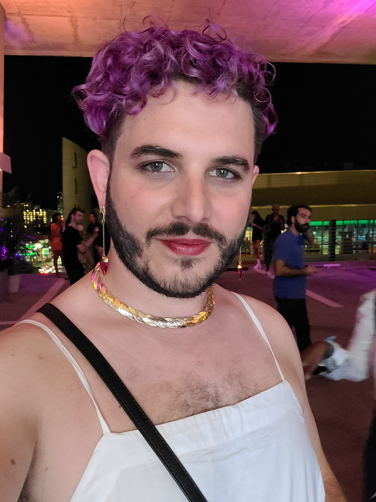
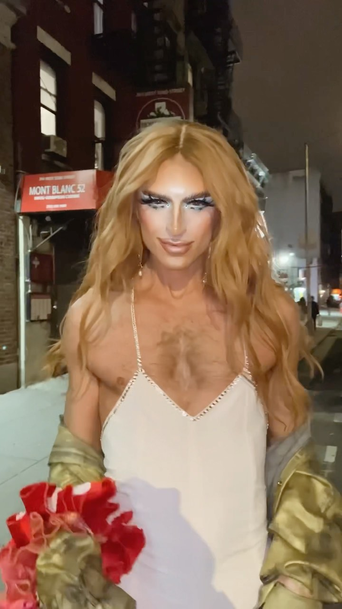

I had a very nice time last week out in Miami, where I was able to attend multiple events surrounding this year's Art Basel exhibition. I had the opportunity to dress up and go out with coworkers who I haven't met in person until now, and on a couple days I wore dresses and did my makeup.

As someone who came out as genderqueer just over a year ago, it was an incredibly affirming and pleasant experience. My coworkers and the strangers I interacted with were supportive, and I felt beautiful.

A day or so later, my partner commented that my outfit was similar to one that a performer, Milk the drag queen, wore recently on Instagram. 

On the surface, and of course as my partner meant it, there are similarities. We both identify as men, wearing white dresses, makeup, and gold jewelry. How the comparison felt was another matter, and I wanted to unpack that feeling some. 

## What's the big deal?

Drag has a significant cultural impact these days. You can go to major cities around the world and go see a drag show. RuPaul's Drag Race has been running since 2009, and for many LGBTQIA+ youth, it can be the first place that they see queerness celebrated publicly, and that is a really meaningful level of visibility for people to have.

The history of Drag Race itself is informative of the tension I feel with drag. RuPaul for a time said he wouldn't allow transgender women to compete on the show, and it wasn't until season 9 in 2017 that an out transgender woman was allowed to compete. It took until this year before a trans man competed on Drag Race.

The relationship between gender identity and gender performance is complicated. There are certainly performers of all identities who perform drag, mixing and matching their own identities with stylistically exaggerated performances of femininity and masculinity. It's an art form that I respect and admire, and may participate in myself someday. 

So, why did the comparison sting? It's because I wasn't doing drag.

## What is drag?

Without trying to place too restrictive definition around it, drag is a type of performance that uses clothing and makeup to perform gender signifiers for entertainment. It's performed to a comedic effect, although not always. 

Performance in general, but drag in particular, involves crafting a persona that you put on display for the sake of the act. That persona may be more closer to or less like yourself, depending on the setting and your artistic vision, but it it is always distinct from the person who is performing. This distinction is typically more pronounced in drag than in other art forms, because the entertainment value is derived in part from the contrast between the identities of the performer and their persona. In its most typical form, it is from the perspective of a cis man, making commentary on femininity.

Others may disagree, but I think that drag comes with a certain level of ironic detachment. The exaggeration creates space for the performer to play with extreme and surprising behavior while preserving distance for themselves as the actor who is putting on a show. Most drag performers use a different name, and different pronouns when they are in character. It's for an act, and they get to put away their drag identity with their outfit when they're done with it.

## What isn't drag?

RuPaul has a famous quote, "We're all born naked, everything else is drag". It's a lighthearted way of deconstructing gender essentialism. Gender is constructed, and in a sense, we're all performing our various intersectional identities to the people around us. There are ways we want to be seen, and we can use all kinds of subtle signifiers to identify those parts of who we are to the people around us.

For the vast majority of my life, I was performing a certain type of masculinity, that allowed me to get by in the Evangelical Christian context that I grew up in. I wrote in my diary about how I viewed my life as a set of masks that I would put on, at different times, for different people. To be able to get along with athletes, I needed to be one sort of way. To be respected at church, I needed to be another person. I could more like my inner self around artists, performers, and musicians, but even then, there was a role for me to play in those groups.

That is where "everything else is drag" breaks down for me. During my performance of masculinity, I felt constrained. Being able to earnestly dress and behave in styles that were in touch with my inner femininity wasn't part of the script I was handed, but it was still something I wanted. No one asked for me to shape my own identity of being a nonbinary man. Not my partner, my friends, my colleagues, and certainly not my parents.

Like many trans and gender-nonconforming people, I purchased my first articles of women's clothing in secret, for no one but myself. All the while, I was being publicly accepted for my performance of my cisgender, heterosexual, evangelical masculinity. I worked through the shame and self-suppression for years, discarding mask after mask until I had the courage to inhabit my own identity in front of other people. The feminine-coded signifiers I proudly display now are not drag. They are a hard-won freedom that I've earned from accepting who I am in my most private and honest self. That identity persists, whether or not I choose to express those signifiers on a given day, or a given moment.

## Why the drag comparison kinda sucks

Simply put, it's reductive. Drag is something that someone puts on and takes off after the show ends and the cameras stop rolling. The comparison to drag is regularly brought up when bigots want to pick on the trans and nonbinary communities, because it delegitimizes us. Bigots like simple categories, and they find ambiguity, particularly in the realm of gender and sexuality, aggravating.

By comparing my gender presentation to drag, it invites the line of thinking that my gender nonconformity is also something that I can take off and put away when I'm not using it. That there is a time and a place for that sort of performance, to be laughed at, but that it doesn't belong when the show is over. And that is simply backwards. When you see me out, wearing something beautiful and vibrant and expressive, it's not fundamentally a performance I'm putting on for you. It's one moment of a long conversation I've been having with myself, which I occasionally let the rest of the world to see a glimpse of.
