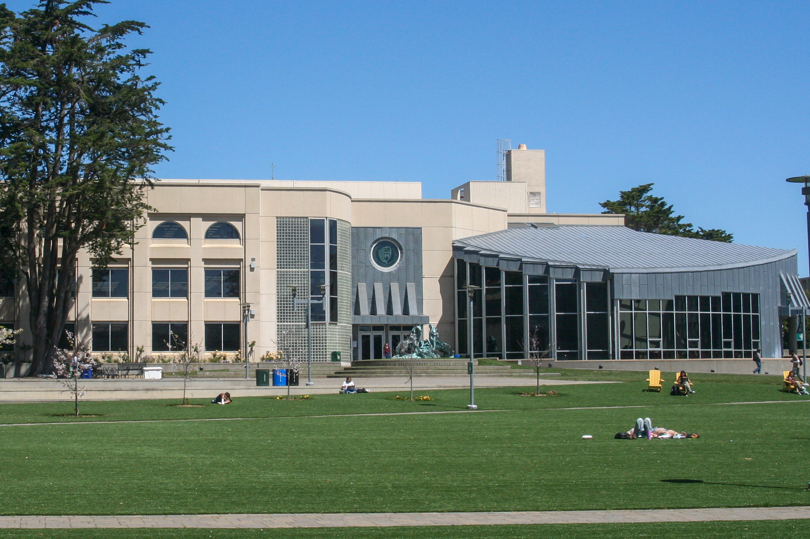

On Monday, April 29th, students set up tents on the university lawn and are calling for the University of San Francisco to divest from its relationship with the state of Israel.

Seeing a tip from my network, I went up to the University of San Francisco to observe a planned student walkout. As of 11:50 there were around a dozen students on the lawn, laying out in the sun and sitting on chairs, enjoying the weather. 

At noon, I heard some shouts and cheers in the distance. I found the crowd gathered in front of the cafeteria, with megaphones, surrounded by organizers wearing high vis vests.

A speaker from the law school spoke about inadequate student housing and pay for professors, in contrast with the university's financial entanglements with the state of Israel.

The speaker also detailed the group's demands:

1. Condemn Israeli occupation's genocide of Palestinians

2. USF must immediately disclose and divest from all Israeli occupation affiliated endowments and investments

3. USF must end all academic partnerships with the Israeli occupation

4. USF must protect pro-Palestine speach and students on campus

At 12:26, the crowd began a march, advancing to the lawn.

As they marched, the students chanted "disclose, divest, we will not stop, we will not rest". They promptly formed a circle and began setting up tents once they reached the lawn.

> "disclose, divest, we will not stop, we will not rest"

At 12:45 the students hung a list of their demands on a tree near the encampment.

Around 200 students were gathered. Several speeches were delivered, with personal experiences of the impact of Israel's occupation delivered. Some people began to arrive with food and other resources for the crowd.

At 1pm, a call went out for muslim students to come forward and pray.

I left to go eat, and returned at 1:42. At that time, the camp was still peaceful, and there were no signs of university or police presence. They declared the camp open, and instructed everyone who participates in the demonstration to abide by their community guidelines.

They had roped off the area they decided to occupy, and a band began playing Killing in the Name of by Rage Against the Machine

The atmosphere by 2pm was positive and relaxed. It is unclear how long the protest will go on at this time, or how the university will respond.

